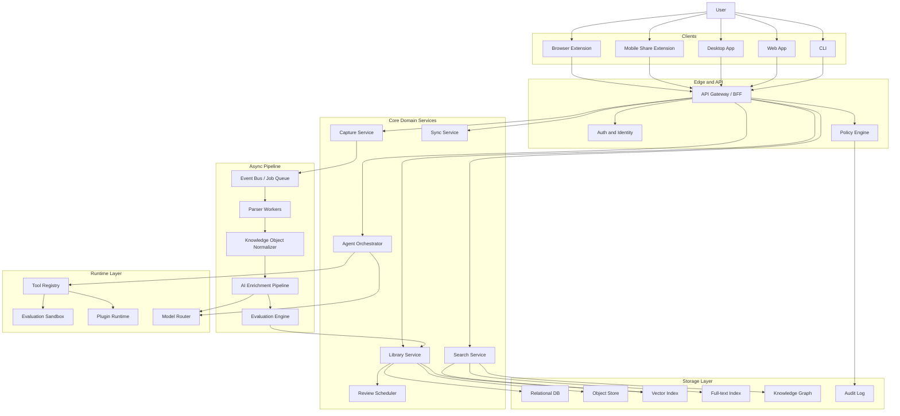
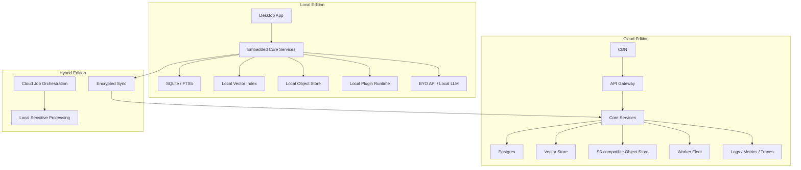
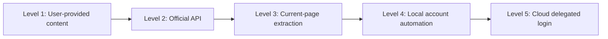
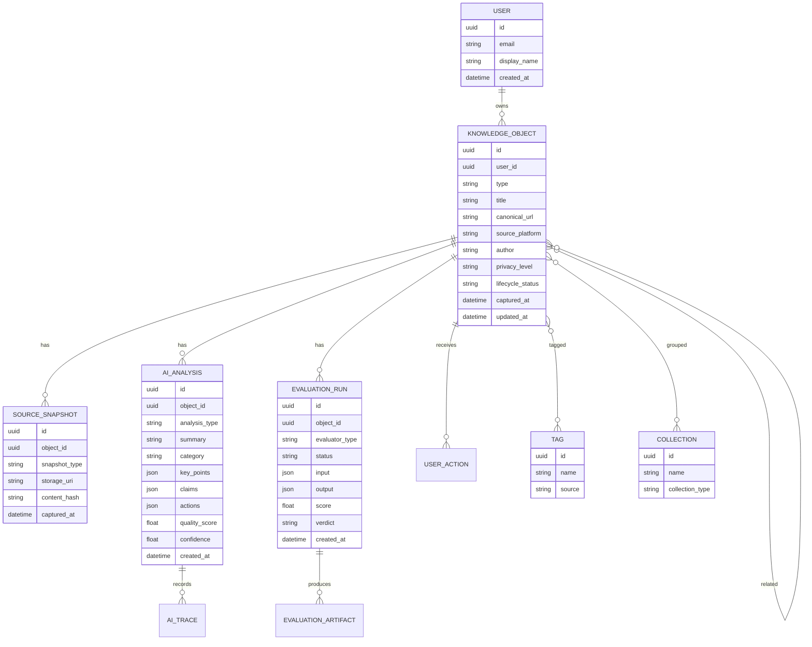
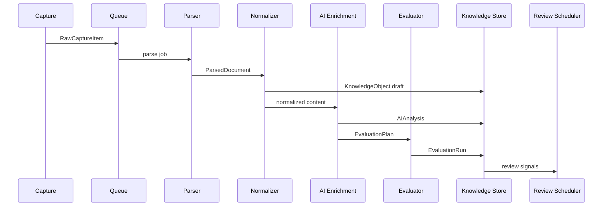
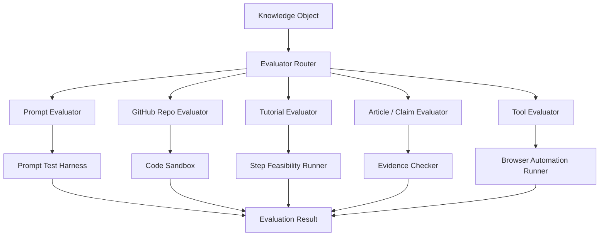
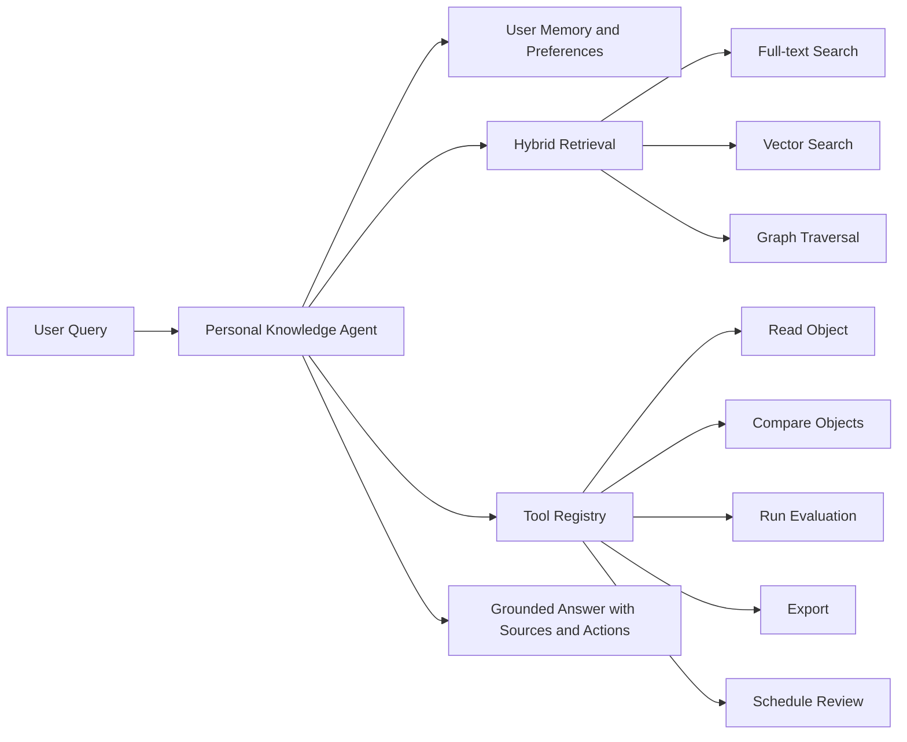
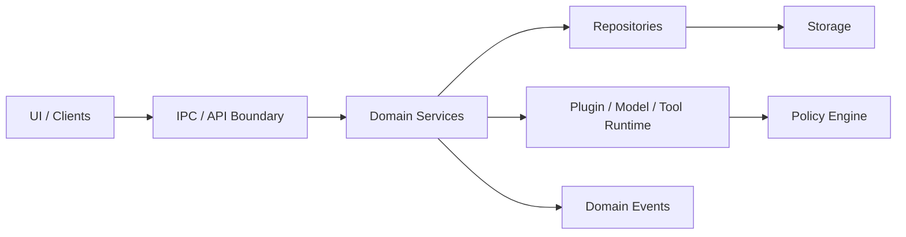

# Link World 架构设计文档

版本: 0.1  
状态: Draft  
最后更新: 2026-06-23

## 1. Vision

Link World 的目标不是做一个更智能的收藏夹，而是做一个面向个人和团队的信息资产处理系统。

用户在 Twitter/X、知乎、小红书、微信、GitHub、博客、论文、视频、Newsletter、聊天工具中看到有价值的信息后，可以通过浏览器扩展、移动端分享、桌面端、导入器或官方 API 将内容保存到 Link World。系统会把原始内容解析为统一的知识对象，并围绕这个对象进行分类、总结、检索、评估、验证、关联、回顾和再利用。

核心问题:

- 用户收藏了大量内容，但很少再次使用。
- 普通收藏夹只负责保存链接，不负责判断内容是否值得花时间。
- AI 总结工具通常只给摘要，不验证内容质量，也不把内容变成可执行资产。
- 跨平台内容分散在各个应用里，无法形成统一的个人知识库。
- 用户对隐私、账号安全、第三方平台规则和模型 API 成本有不同偏好。

产品原则:

- 第一版功能可以少，但架构边界必须完整。
- 系统必须支持 Local Edition、Cloud Edition、Hybrid Edition 三种形态。
- 系统必须通过插件扩展平台连接器、解析器、评估器、模型供应商和同步后端。
- AI 结论必须可回溯到原文、快照、模型、prompt、时间和插件版本。
- 第三方平台采集必须有合规边界，默认不做云端代登录和批量抓取。

第一版能力边界:

- 浏览器扩展保存当前网页、链接、选中文本和截图。
- 保存并分析普通网页文章。
- 保存并分析 GitHub repository。
- 保存并分析 prompt。
- 本地库、全文搜索、向量搜索和可选 AI API。
- 暂不做微信、知乎、小红书、X 的云端代登录采集。

## 2. Architecture Principles

### 2.1 Local-first

Local Edition 是一等公民，不是 Cloud Edition 的离线缓存。核心解析、知识对象模型、AI pipeline、检索、评估和插件系统都必须可以在本地运行。

默认策略:

- 本地存储使用 SQLite + FTS5。
- 本地向量索引使用 sqlite-vec、LanceDB 或同级可嵌入方案。
- 原始快照、截图、附件和解析产物存放在本地对象目录。
- 用户可以配置自己的 OpenAI、Anthropic、Gemini、DeepSeek、Ollama 或其他兼容 API。
- 没有云账号时，产品仍然可以完整工作。

### 2.2 Cloud optional

Cloud Edition 负责多端同步、团队协作、托管任务、托管存储、高可用 worker、官方连接器和统一模型网关，但不能成为架构上的唯一真相源。

云端能力必须可以按模块关闭:

- 云同步可关闭。
- 云端 AI 可关闭。
- 云端插件可关闭。
- 云端团队空间可关闭。
- 用户可以只使用本地数据和本地模型。

### 2.3 Plugin-first

平台变化快，连接器和评估逻辑不能写死在主系统中。所有外部平台、文件类型、模型供应商、评估逻辑都通过插件注册。

插件类型:

- `ConnectorPlugin`: 采集内容。
- `ParserPlugin`: 解析原始内容。
- `EvaluatorPlugin`: 验证内容价值。
- `ModelProvider`: 接入模型服务。
- `SyncProvider`: 实现同步后端。
- `ExportPlugin`: 导出到 Obsidian、Notion、Markdown、JSON 等目标。

### 2.4 Traceable AI

任何 AI 结论都必须可以追踪:

- 使用了哪个模型。
- 使用了哪个 prompt template。
- 输入了哪些原文片段。
- 由哪个插件或 pipeline step 生成。
- 生成时间和版本。
- 用户是否编辑过。
- 后续 evaluator 是否确认或推翻过。

### 2.5 Privacy tiering

内容按照隐私等级处理:

- `public`: 公开网页、公开 GitHub repo、公开视频。
- `personal`: 用户个人收藏、选中文本、批注、阅读记录。
- `sensitive`: 私密笔记、私有 repo、聊天内容、账号相关页面。
- `secret`: token、cookie、session、API key、身份凭据。

不同隐私等级决定:

- 是否允许云同步。
- 是否允许调用第三方 AI。
- 是否允许进入团队空间。
- 是否允许被插件读取。
- 是否允许生成分享链接。

### 2.6 Connector isolation

平台连接器必须隔离。第三方平台的规则、反爬限制、登录状态和页面结构变化不能污染核心系统。

默认策略:

- 官方 API 优先。
- 用户主动保存优先。
- 当前页面 DOM 采集优先于后台批量抓取。
- 本地自动化只作为高级插件，不作为云端默认能力。
- 云端不托管第三方平台账号密码、cookie 和 session。

## 3. System Overview

### 3.1 Logical architecture



### 3.2 Deployment modes



### 3.3 Recommended implementation topology

第一阶段建议使用模块化单体，而不是立即拆成大量微服务。

推荐形态:

- 一个核心应用进程承载 API、Library、Search、Agent、Sync 的模块边界。
- 一个 worker 进程承载 Parser、AI Enrichment、Evaluation。
- 插件运行在隔离进程或 sandbox worker 中。
- 本地版把 core 和 worker 嵌入桌面应用。
- 云端版把 core、worker、queue、storage 独立部署。

这样可以保持架构清晰，同时避免第一版被分布式系统复杂度拖垮。

## 4. Capture Architecture

### 4.1 Capture sources

系统支持以下输入来源:

- URL。
- 当前网页 DOM。
- 选中文本。
- 截图。
- PDF、EPUB、Markdown、HTML、文档。
- GitHub repository。
- YouTube 视频和 transcript。
- Newsletter 邮件。
- RSS feed。
- 用户手写 note。
- 第三方导入文件。
- 官方 API 或 OAuth 连接器。

### 4.2 Connector risk levels



风险等级:

| Level | 类型 | 默认支持 | 云端支持 | 说明 |
| --- | --- | --- | --- | --- |
| 1 | 用户主动提交文本、文件、URL | 是 | 是 | 风险最低 |
| 2 | 官方 API、OAuth、RSS、Webhook | 是 | 是 | 推荐方式 |
| 3 | 浏览器扩展提取当前页面 | 是 | 有限制 | 用户正在访问页面时主动保存 |
| 4 | 本地自动化用户账号 | 高级选项 | 否 | 仅本地插件，不托管凭据 |
| 5 | 云端代登录和批量抓取 | 否 | 否 | 默认禁区 |

### 4.3 Capture contract

所有连接器输出统一的 `RawCaptureItem`。

```ts
type CaptureSource =
  | "url"
  | "dom"
  | "selection"
  | "screenshot"
  | "file"
  | "api"
  | "import"
  | "local_automation";

interface RawCaptureItem {
  id: string;
  userId: string;
  sourceType: CaptureSource;
  sourcePlatform?: string;
  sourceUrl?: string;
  canonicalUrl?: string;
  title?: string;
  author?: string;
  capturedAt: string;
  rawText?: string;
  rawHtml?: string;
  assets?: CaptureAsset[];
  metadata: Record<string, unknown>;
  privacyLevel: "public" | "personal" | "sensitive" | "secret";
  permissionContext: PermissionContext;
}

interface CaptureAsset {
  id: string;
  kind: "image" | "video" | "audio" | "file" | "snapshot";
  mimeType: string;
  uri: string;
  sha256?: string;
}

interface PermissionContext {
  acquisitionMode: "user_action" | "official_api" | "import" | "local_automation";
  userConfirmed: boolean;
  platformTermsHint?: string;
  allowedForCloudProcessing: boolean;
  allowedForThirdPartyAI: boolean;
}
```

### 4.4 Platform compliance boundary

默认产品政策:

- 云端不保存第三方平台账号密码。
- 云端不保存第三方平台 cookie、session、refresh token，除非是官方 OAuth token。
- 云端不模拟用户浏览器批量抓取平台内容。
- 本地高级插件必须显式提示风险，并允许用户自行启停。
- 第三方平台内容公开展示时，必须遵守对应平台展示、删除、归属和再分发要求。
- 用户删除内容时，派生摘要、向量、截图、缓存、评估结果也必须进入删除流程。

## 5. Knowledge Object Model

### 5.1 Object types

`KnowledgeObject` 是系统内部的统一知识资产。

支持对象类型:

- `article`
- `social_post`
- `thread`
- `prompt`
- `github_repo`
- `tool`
- `tutorial`
- `paper`
- `video`
- `podcast`
- `conversation`
- `note`
- `dataset`
- `file`
- `collection`

### 5.2 Entity relationship



### 5.3 Lifecycle status

知识对象生命周期:

- `captured`: 已采集，未解析。
- `parsed`: 已解析。
- `enriched`: 已完成 AI 分析。
- `evaluated`: 已完成至少一次评估。
- `triaged`: 用户或 agent 已处理。
- `archived`: 已归档。
- `deleted`: 已删除或等待清理。
- `failed`: pipeline 失败，需要重试或人工处理。

### 5.4 Source snapshot policy

每个对象至少保存:

- 原始来源引用，例如 URL、repo URL、文件路径。
- 采集时间。
- 原始文本或解析后的正文。
- 内容 hash。
- 解析器版本。

是否保存完整 HTML、截图、附件或媒体，取决于隐私级别、存储策略和平台规则。

## 6. AI Processing Pipeline

### 6.1 Pipeline overview



### 6.2 Processing stages

1. Capture
   - 接收用户提交内容。
   - 记录权限上下文和隐私等级。
   - 生成原始采集记录。

2. Parse
   - 抽取正文、标题、作者、发布时间、图片、链接和元数据。
   - URL 拉取的 HTML 与浏览器扩展提交的已清洗 DOM 复用同一 Rust parser，统一生成正文纯文本和 Markdown。
   - Markdown 是稳定展示格式；前端阅读 AST 只在渲染时派生，不作为后端数据模型持久化。
   - 对 GitHub repo 抽取 README、license、语言、依赖、活跃度。
   - 对 prompt 抽取任务、变量、输入要求、输出格式和使用场景。

3. Normalize
   - 映射为 `KnowledgeObject`。
   - 写入 source snapshot。
   - 计算内容 hash。
   - 去重或合并相同来源。

4. Enrich
   - 生成摘要。
   - 分类和打标签。
   - 抽取关键结论、行动项、风险点、引用和 claim。
   - 关联旧收藏。
   - 生成质量初评分。
   - 可选生成版本化的文档级展示提示；提示只建议展示模式，不修改正文、Markdown 或安全策略。

5. Evaluate
   - 根据对象类型选择 evaluator。
   - 生成验证计划。
   - 在允许的 sandbox 中执行测试。
   - 生成 verdict、score、证据和失败原因。

6. Index
   - 写入全文索引。
   - 写入向量索引。
   - 更新知识图谱边。

7. Review
   - 生成稍后阅读、复习、实验、任务或归档建议。
   - 支持基于遗忘曲线、兴趣变化和项目上下文的再唤醒。

### 6.3 AI analysis output

AI enrichment 的标准输出:

```ts
interface AIAnalysisOutput {
  summary: string;
  category: string;
  tags: string[];
  keyPoints: string[];
  claims: Claim[];
  actionItems: ActionItem[];
  risks: RiskItem[];
  relatedObjectIds: string[];
  qualityScore: number;
  confidence: number;
  displayHints?: {
    schemaVersion: 1;
    mode: "article" | "tutorial" | "reference" | "code-heavy";
    confidence: number;
    reason?: string;
  };
  recommendedNextAction:
    | "read_now"
    | "archive"
    | "evaluate"
    | "turn_into_task"
    | "schedule_review"
    | "discard";
}

interface Claim {
  text: string;
  evidence?: string;
  confidence: number;
}

interface ActionItem {
  title: string;
  description?: string;
  estimatedMinutes?: number;
  requiredTools?: string[];
}

interface RiskItem {
  type: "outdated" | "low_evidence" | "security" | "cost" | "legal" | "platform" | "other";
  severity: "low" | "medium" | "high";
  detail: string;
}
```

文档阅读模式由前端 Markdown AST 的确定性规则推断。仅当 AI analysis 绑定当前 `parsedDocumentId`、提示 schema 合法且置信度至少为 `0.75` 时，才允许覆盖该模式。AI 提示缺失、过期或无效时必须回退到 AST 推断；提示永远不能改变 HTML 清洗、URL 协议、图片隐私属性或组件安全边界。

## 7. Evaluation Engine

### 7.1 Purpose

Evaluation Engine 是 Link World 和普通 AI 收藏工具的主要差异。它不只总结内容，还判断内容是否值得使用，并在可行时进行小规模验证。

目标:

- 判断收藏内容是否有实际价值。
- 把内容转成可验证的实验。
- 给出明确 verdict，而不是模糊摘要。
- 记录评估证据，避免 AI 空泛判断。

当前实现边界：Prompt 与 GitHub Repo evaluator 以 `local_deterministic` capability 运行，不访问网络、模型或 sandbox。客户端为一次用户动作生成 UUID `requestId`；后端以同一值作为 job id 和 correlation id，在短事务中先写 `evaluation_runs(planned)`、`background_jobs(queued)`、`evaluation_traces(planned)` 与 `evaluation.planned`，再推进 running，最后原子提交 passed/trace/artifact/object lifecycle/`evaluation.completed`。重复的同 identity 请求返回原 run；跨 object/evaluator 复用同 UUID fail closed。plan/input/output contract 当前均为 schema version 1；本地 evaluator 在 2 秒上限内由独立阻塞任务执行，超时收敛为 `evaluation.timeout`。每个新 run 同事务创建 privacy-bounded `evaluation_traces` 行，成功或失败时与 run/job 一起终结；应用启动会把残留 running run（包括旧版本已先标记 failed 的 job）收敛为 `evaluation.interrupted`、清理孤立 artifact，并延续 correlation 日志。
### 7.2 Evaluator routing



### 7.3 Evaluator types

Prompt Evaluator:

- 抽取 prompt 目标、变量和输出格式。
- 生成基准测试任务。
- 与 baseline prompt 对比。
- 评估输出质量、稳定性和成本。

GitHub Repo Evaluator:

- 检查 README、license、最近提交、release、issue、stars、forks。
- 识别安装方式和运行环境。
- 在允许时执行 dry-run 或 sandbox install。
- 输出可用性、维护状态和安全风险。

Tutorial Evaluator:

- 拆解步骤。
- 检查前置条件。
- 判断是否缺少关键步骤。
- 生成用户可执行 checklist。

Article / Claim Evaluator:

- 抽取核心论点。
- 检查证据强度。
- 搜索内部知识库是否有支持或反例。
- 标记可能过期或高风险的观点。

Tool Evaluator:

- 识别工具入口、定价、平台、登录要求和替代品。
- 通过 browser runner 执行基础可访问性检查。
- 输出是否值得试用。

### 7.4 Scoring dimensions

评估维度:

| Dimension | 含义 |
| --- | --- |
| `novelty` | 是否提供新信息或新方法 |
| `utility` | 是否能解决真实问题 |
| `actionability` | 是否足够可执行 |
| `credibility` | 证据和来源是否可靠 |
| `cost` | 时间、金钱、算力或维护成本 |
| `risk` | 安全、隐私、法律、平台或误导风险 |
| `fit` | 是否匹配用户兴趣和项目上下文 |
| `test_result` | 实际验证结果 |

### 7.5 Evaluation result

```ts
interface EvaluationResult {
  id: string;
  requestId?: string; // legacy run may omit
  correlationId?: string;
  objectId: string;
  evaluatorType: string;
  evaluatorVersion: string;
  planSchemaVersion: 1;
  inputSchemaVersion: 1;
  outputSchemaVersion: 1;
  status: "planned" | "running" | "passed" | "failed" | "skipped" | "blocked";
  score: number;
  verdict: "high_value" | "useful" | "situational" | "low_value" | "unsafe" | "unknown";
  dimensions: Record<string, number>;
  evidence: EvidenceItem[];
  artifacts: EvaluationArtifact[];
  limitations: string[];
  nextActions: ActionItem[];
  createdAt: string;
}

interface EvidenceItem {
  source: "original_content" | "internal_library" | "external_check" | "sandbox_run" | "user_feedback";
  text: string;
  reference?: string;
}

interface EvaluationArtifact {
  kind: "log" | "screenshot" | "diff" | "test_output" | "generated_prompt" | "report";
  uri: string;
  metadata?: Record<string, unknown>;
}
```

## 8. Agent Runtime

### 8.1 Agent responsibilities

Agent Runtime 提供用户和知识库之间的行动层。

Agent 类型:

- `LibraryAgent`: 问答、查找、对比、总结。
- `TriageAgent`: 批量清理未读内容，决定读、归档、删除或评估。
- `EvaluatorAgent`: 对指定对象生成验证计划并调用 evaluator。
- `ActionAgent`: 把收藏转成任务、实验、学习计划或项目材料。
- `ReviewAgent`: 定期重新唤醒高价值内容。

### 8.2 Tool-mediated access

Agent 不直接访问数据库、文件系统、外部网络或第三方账号。所有能力必须通过 Tool Registry 暴露。



### 8.3 Agent response policy

Agent 回答必须:

- 给出来源引用。
- 区分原文事实、AI 推断和评估结论。
- 标记低置信度内容。
- 对高风险建议要求用户确认。
- 对平台账号、自动化抓取和外部发布动作使用显式权限。

## 9. Storage & Sync

### 9.1 Local storage

Local Edition 推荐:

- SQLite: 核心元数据、对象、标签、集合、分析结果。
- SQLite FTS5: 全文搜索。
- sqlite-vec 或 LanceDB: 本地向量索引。
- Local object store: HTML 快照、截图、附件、日志、评估产物。
- Local audit log: 关键操作、AI 调用和插件访问记录。
- Local restore points: SQLite 一致性快照、对象文件与版本化 hash manifest；不等同于便携导出。
- Restore lifecycle: 在线 prepare + safety backup；重启后在 pool 建立前用 phase marker 切换；候选初始化失败自动 rollback。
- Portable exports: app data `exports/<export-id>/` 下的 Markdown/JSON 目录；默认排除 secret、credential reference、内部 job 和本机 storage URI，不等同于 restore point。
- Startup migration guard: 已有用户 schema 在 SQLx migration 前创建并验证 restore point；不确定的 running phase 阻止自动重试。

- Startup recovery UI: 启动失败时注册受限 `StartupState::Recovery`，不挂载普通 Library、不启动后台服务，只允许列出/验证 restore point、显式准备恢复或重启重试。
本地数据目录需要明确分层:

- `metadata`: 结构化数据库。
- `objects`: 原文、快照、附件。
- `indexes`: 全文和向量索引。
- `plugins`: 插件包和插件配置。
- `secrets`: 本地加密凭据。
- `logs`: 本地运行日志。
- `backups`: 先 staging、后原子发布的同机 restore point；包含用户内容，不包含 credential value。
- `restore`: 有界 pending phase marker、迁移后的私有 candidate、短期 rollback payload 和脱敏 last result。
- `migration`: 有界 prepared/running guard 和脱敏 last result；只保存 restore point 标识与 schema/app 版本。

### 9.2 Cloud storage

Cloud Edition 推荐:

- Postgres: 业务主库。
- pgvector 或专用向量库: 向量检索。
- S3-compatible object store: 快照和附件。
- Redis Queue、Temporal 或 Workflow engine: 异步任务。
- OpenTelemetry: traces、metrics、logs。
- KMS: 密钥管理。
- Audit table: 用户、插件、AI 和管理员操作审计。

### 9.3 Hybrid sync

Hybrid Edition 的原则:

- 敏感内容默认留在本地。
- 云端只保存加密后的同步包或低敏元数据。
- 用户可以按 collection、tag、privacy level 选择同步范围。
- 同步冲突必须保留双方版本，不能静默覆盖。

同步对象:

- Knowledge metadata。
- 用户标签和集合。
- AI analysis。
- Evaluation result。
- Review schedule。
- 用户编辑和反馈。

默认不同步:

- 第三方平台 cookie。
- 本地自动化插件 session。
- `secret` 级别对象。
- 用户明确标记为 local-only 的对象。

### 9.4 Conflict resolution

冲突解决策略:

- 元数据字段使用 last-write-wins，但保留操作日志。
- 用户正文编辑使用版本链。
- AI analysis 按版本并存。
- tag 和 collection 使用集合合并。
- 删除操作进入 tombstone，不立即物理删除。

## 10. Plugin Interfaces

以下接口是文档级 contract，不是当前实现代码。

### 10.1 ConnectorPlugin

```ts
interface ConnectorPlugin {
  id: string;
  name: string;
  version: string;
  capabilities(): ConnectorCapabilities;
  capture(input: CaptureInput, context: PluginContext): Promise<RawCaptureItem>;
  refresh?(sourceRef: SourceRef, context: PluginContext): Promise<RawCaptureItem>;
}

interface ConnectorCapabilities {
  sources: CaptureSource[];
  supportsCloud: boolean;
  supportsLocal: boolean;
  requiresUserAction: boolean;
  requiresOAuth: boolean;
  riskLevel: 1 | 2 | 3 | 4 | 5;
}
```

### 10.2 ParserPlugin

```ts
interface ParserPlugin {
  id: string;
  version: string;
  supports(raw: RawCaptureItem): boolean;
  parse(raw: RawCaptureItem, context: PluginContext): Promise<ParsedDocument>;
}

interface ParsedDocument {
  title?: string;
  author?: string;
  publishedAt?: string;
  text: string;
  html?: string;
  links: string[];
  assets: CaptureAsset[];
  metadata: Record<string, unknown>;
  parserTrace: ParserTrace;
}
```

### 10.3 EvaluatorPlugin

```ts
interface EvaluatorPlugin {
  evaluatorType: string;
  evaluatorVersion: string;
  capability(): EvaluatorCapability;
  supports(input: VersionedEvaluationInput, requestedType: string): boolean;
  plan(input: VersionedEvaluationInput): Promise<VersionedEvaluationPlan>;
  run(
    input: VersionedEvaluationInput,
    plan: VersionedEvaluationPlan,
    context: EvaluationContext,
  ): Promise<VersionedEvaluationOutput>;
}
```

### 10.4 ModelProvider

模型品牌（`provider`）与线协议（`apiFamily`）必须分离。业务 service 只依赖能力契约，由 registry 按协议选择 adapter；供应商名称只用于配置、trace 和 OpenAI-compatible 的已知扩展。

Provider 配置是全局运行时设置，不属于单个 Knowledge Object。多个配置使用稳定 id；`local_settings.models.default.chat.config_id` 只选择一个默认 Chat 配置。默认项失效或被删除时调用显式失败，不跨第三方 provider 自动 failover。凭据通过 OS secret backend 解析，配置表和前端只接触引用与 `hasApiKey`。

```ts
type ModelApiFamily =
  | 'openai_chat_completions'
  | 'openai_responses'
  | 'anthropic_messages'
  | 'google_generative_ai'
  | 'ollama';

interface TextGenerationProvider {
  implementationId: string;
  supports(apiFamily: ModelApiFamily): boolean;
  generate(request: TextGenerationRequest): Promise<TextGenerationResponse>;
}
```

当前内置 `genai` adapter 统一实现上述五种协议；OpenAI-compatible 自定义供应商通过 `provider + apiFamily + baseUrl + model` 配置，不在 AI enrichment service 中增加 vendor-specific HTTP 分支。Embedding、rerank、vision 后续使用独立 capability contract 与 registry，不能把所有能力塞进单一 chat 接口。

### 10.5 SyncProvider

```ts
interface SyncProvider {
  id: string;
  push(changes: ChangeSet): Promise<SyncCursor>;
  pull(cursor: SyncCursor): Promise<ChangeSet>;
  resolveConflict(conflict: SyncConflict): Promise<ResolvedChange>;
}
```

### 10.6 Plugin security model

插件必须声明:

- 需要读取的数据类型。
- 需要访问的网络域名。
- 是否需要文件系统。
- 是否需要浏览器自动化。
- 是否允许云端运行。
- 是否允许读取 sensitive 内容。
- 是否会调用第三方 AI。

插件运行时必须记录:

- 插件 ID 和版本。
- 输入对象 ID。
- 权限授权结果。
- 输出产物。
- 错误和重试。
- 资源消耗。

## 11. Security, Privacy, Compliance

### 11.1 Credential handling

凭据分类:

- AI API key。
- 官方 OAuth token。
- 第三方平台 session。
- 本地插件 secret。
- 云端同步密钥。

默认策略:

- AI API key 本地加密保存。
- 官方 OAuth token 只用于声明过的 connector。
- 第三方平台 cookie 和 session 只能存在本地高级插件环境。
- 云端不托管非官方登录凭据。
- 凭据读取必须经过权限检查和审计。

### 11.2 Third-party platform content

处理第三方平台内容时:

- 保留来源信息和采集时间。
- 尊重删除、不可见、私密和 blocked 状态。
- 不将用户 A 凭据获得的内容展示给用户 B。
- 不把平台内容作为可下载公开数据集。
- 不默认把平台内容用于训练或微调模型。

### 11.3 AI calls

AI 调用策略:

- 每次调用记录模型、供应商、prompt template、输入摘要、输出和成本。
- sensitive 内容调用第三方 AI 前必须有用户授权。
- secret 内容禁止发送到第三方 AI。
- 本地模型调用仍然记录 trace。
- 支持 AI 输出缓存，但缓存必须跟随对象删除。

### 11.4 Deletion

删除必须覆盖:

- KnowledgeObject。
- SourceSnapshot。
- AIAnalysis。
- EvaluationRun。
- 向量索引。
- 全文索引。
- 对象存储。
- 缓存。
- 同步副本。
- 导出队列中的待处理任务。

云端删除使用 tombstone + background purge。Local Edition 可以提供立即物理删除选项。

### 11.5 Auditability

必须审计:

- 登录和设备绑定。
- 数据导入、导出、删除。
- 插件安装、启用、权限变更。
- AI 调用。
- sync push 和 pull。
- 高风险采集器启用。
- evaluator sandbox 执行。

## 12. MVP Boundary

第一版必须控制范围，但不能破坏架构可扩展性。

MVP included:

- 浏览器扩展保存当前网页。
- 保存 URL、选中文本、截图。
- 网页正文解析。
- GitHub repository 分析。
- Prompt 分析。
- SQLite + FTS 本地知识库。
- 本地对象存储。
- 基础向量检索。
- BYO AI API。
- AI 摘要、分类、标签、行动项、质量初评分。
- Prompt Evaluator 和 GitHub Repo Evaluator 的最小版本。
- Markdown / JSON 导出。

MVP excluded:

- 云端代登录第三方平台。
- 微信、知乎、小红书、X 的后台批量抓取。
- 团队协作。
- 公开分享市场。
- 复杂移动端原生客户端。
- 大规模微服务拆分。
- 自动微调模型。

MVP 架构要求:

- 所有 capture 仍然走 `RawCaptureItem`。
- 所有对象仍然落到 `KnowledgeObject`。
- 所有 AI 输出仍然写入 `AIAnalysis`。
- 所有 evaluator 输出仍然写入 `EvaluationRun`。
- 插件接口先作为内部 contract 存在，即使第一版只内置少量插件。

## 13. Architecture Acceptance Criteria

后续实现必须满足以下架构验收标准。

### 13.1 Data model acceptance

- 保存网页、GitHub repo、prompt 三种对象后，都能进入同一 `KnowledgeObject` 模型。
- 每个对象都有 source snapshot、内容 hash 和解析器版本。
- AI 输出和评估结果不覆盖原文。
- 同一对象可以拥有多个 AI analysis 版本。
- 同一对象可以拥有多个 evaluation run。

### 13.2 Local-first acceptance

- 断网时，本地版仍能浏览已保存内容、搜索、查看分析结果。
- 不登录云账号时，本地版仍能保存内容。
- 不配置第三方 AI 时，本地版仍能作为普通知识库使用。
- 配置本地模型后，本地版可完成基本摘要和分类。

### 13.3 Plugin acceptance

- 新增一个网页解析器不需要改数据库 schema。
- 新增一个平台 connector 不需要改 Agent 核心。
- 新增一个 evaluator 不需要改 Capture Service。
- 插件权限必须可声明、可查看、可撤销。
- 插件输出必须可追踪版本。

### 13.4 AI trace acceptance

- 任意摘要可以追踪到原文片段、模型、prompt template 和生成时间。
- 任意质量评分可以追踪到 evaluator 和评分维度。
- 用户可以区分原文内容、AI 推断和 evaluator 结论。
- 删除对象后，对应向量、缓存和 AI 派生产物进入删除流程。

### 13.5 Compliance acceptance

- 云端不支持保存第三方平台账号密码。
- 云端不支持非官方 cookie/session 托管。
- 本地高级自动化插件必须显式展示风险。
- 用户主动保存和官方 API 是默认采集路径。
- 导出内容必须保留来源信息。

### 13.6 Operational acceptance

- pipeline job 可以重试。
- 单个解析失败不会阻塞整个库。
- AI 供应商失败时可以 fallback 或标记失败。
- worker 产物写入必须幂等。
- 云端服务必须具备基础 logs、metrics、traces。

## 14. Domain Boundaries

商业级实现必须把业务域边界固定下来，避免后续代码在 UI、数据库、AI 和插件之间互相穿透。

### 14.1 Bounded contexts

| Context | Ownership | Core entities | Forbidden dependencies |
| --- | --- | --- | --- |
| Capture | 接收用户主动提交内容 | `RawCaptureItem`, `SourceSnapshot` | 不调用 AI，不直接写 evaluation |
| Parser | 把原始内容变成正文 | `ParsedDocument` | 不发网络请求，不读模型配置 |
| Library | 管理知识对象生命周期 | `KnowledgeObject`, `Tag`, `Collection` | 不执行平台采集 |
| AI | 模型路由和可追踪输出 | `AIAnalysis`, `AITrace` | 不绕过 privacy policy |
| Evaluation | 生成价值判断和证据 | `EvaluationRun`, `EvaluationArtifact` | 不直接访问外部凭据 |
| Search | 全文、向量、图检索 | FTS rows, vector chunks, relations | 不成为正文 source of truth |
| Agent | 编排工具调用 | Tool calls, grounded response | 不直接读写数据库 |
| Security | 凭据、权限、审计 | Secret refs, policy decisions, audit logs | 不依赖 UI 状态 |
| Sync | 本地/云端数据同步 | ChangeSet, tombstone, conflict | 不同步 secret 默认数据 |

### 14.2 Dependency rule

允许的依赖方向：



禁止：

- UI 直接访问数据库。
- Parser 直接调用 LLM。
- Agent 直接读写 SQLite。
- 插件绕过 Policy Engine 访问 secret。
- FTS、vector index 或 cache 成为业务数据源。

## 15. Event Model

系统内部应使用显式事件连接异步 pipeline。Local Edition 可以用 SQLite-backed queue 或内存队列加持久化 outbox；Cloud Edition 可映射到 Redis Queue、Temporal、Workflow engine 或事件总线。

### 15.1 Core domain events

| Event | Producer | Consumers |
| --- | --- | --- |
| `capture.submitted` | Capture | Parser scheduler, audit |
| `snapshot.created` | Capture | Parser scheduler |
| `object.parsed` | Parser | AI enrichment, FTS indexing, UI |
| `object.failed` | Capture / Parser | UI, retry scheduler, audit |
| `analysis.requested` | AI | Model router, UI |
| `analysis.created` | AI | Search indexing, Review scheduler, UI |
| `analysis.failed` | AI | UI, retry scheduler, audit |
| `evaluation.planned` | Evaluation | Worker |
| `evaluation.completed` | Evaluation | Library, Review scheduler, UI |
| `object.deleted` | Library | Index cleanup, object store cleanup, sync |
| `privacy.changed` | Library / Security | AI policy reevaluation, sync policy |
| `plugin.permission.changed` | Security | Plugin runtime, audit |

### 15.2 Event envelope

```ts
interface DomainEvent<TPayload> {
  id: string;
  type: string;
  version: number;
  objectId?: string;
  userId: string;
  occurredAt: string;
  causationId?: string;
  correlationId?: string;
  payload: TPayload;
}
```

事件处理要求：

- Event handler 必须幂等。
- 同一次关键操作产生的事件必须共享稳定 correlation id，并由其持久化控制载体跨重启延续；capture 与 AI enrichment 在提交时生成 UUID，并由 job payload、domain events、IPC result 和结构化日志复用；search rebuild/reindex 是一项操作对应一个持久化 job，直接用 UUID job id；startup migration 将 UUID 写入 prepared/running guard 并复制到 last-result，legacy guard 使用原 UUID backup id；restore 复用 transaction UUID，并写入 prepare result、四阶段 pending marker 与 last-result。控制载体中的非 UUID 值不得直接进入日志。
- 事件 payload 只保存处理所需的结构化元数据，不复制完整 URL、query/fragment、正文、cookie、token 或第三方原始错误。
- 同一事件重复投递不得产生重复 AI analysis 或重复 evaluation artifact。
- 失败状态必须持久化稳定 `failure_reason` 和 retry policy；事件 payload 只保留消费方所需的稳定 error code，不复制用户内容或原始错误。
- 删除事件必须驱动索引、缓存、向量和对象存储清理。

## 16. Job and Retry Architecture

所有耗时任务都通过 job runner 执行，不允许阻塞 UI 或 IPC 请求。

Job 类型：

- `capture.fetch_url`
- `parser.extract_document`
- `ai.enrich_object`
- `embedding.create_chunks`
- `evaluation.run`
- `search.rebuild_index`
- `search.reindex_object`
- `review.schedule_object`
- `storage.purge_deleted_object`
- `sync.push_changes`
- `sync.pull_changes`

Job 字段：

- `id`
- `type`
- `status`
- `object_id`
- `payload_json`
- `attempt_count`
- `max_attempts`
- `next_run_at`
- `locked_at`
- `locked_by`
- `last_error`

Retry policy：

- 网络失败：指数退避，最多 3 次。
- 解析失败：默认不自动重试，除非 parser 版本更新。
- AI 失败：按 provider 错误类型重试；余额、鉴权和 policy 拒绝不重试。
- Evaluation 失败：保留 partial artifacts，允许用户手动重跑。
- 删除清理失败：必须后台重试直到完成或用户确认忽略。

## 17. Commercial-Grade Non-Functional Requirements

### 17.1 Performance budgets

| Capability | Target |
| --- | --- |
| App cold start | P95 < 3s |
| Library list render, 5000 objects | P95 < 500ms after DB query |
| FTS search, 1000 objects | P95 < 200ms |
| URL capture acknowledgement | P95 < 300ms after submit |
| Common article parse | P95 < 8s excluding slow network |
| AI enrichment | Async only; no UI blocking |

### 17.2 Reliability targets

- Local queue jobs are persisted before execution.
- Database writes are transactional around lifecycle changes.
- A failed worker cannot corrupt object status.
- Migration creates a backup or restore point before destructive changes.
- Restore failure converges to either a validated candidate or a validated rollback; partial live storage must never start.
- Every external call has timeout, cancellation and error classification.

### 17.3 Security targets

- Secrets never appear in logs, frontend persisted stores, export files or crash reports.
- Plugin permissions are deny-by-default.
- Sensitive objects require explicit policy approval before third-party AI calls.
- Local object store paths must be canonicalized to prevent path traversal.
- Evaluation sandbox must use explicit resource limits.

## 18. Observability and Operations

Local Edition 也需要可观测性，但默认只对用户本机可见。

### 18.1 Logs

日志级别：

- `error`: 任务失败、数据库错误、权限拒绝。
- `warn`: 降级、重试、模型输出解析失败。
- `info`: lifecycle transition、job completed、plugin loaded。
- `debug`: 仅开发模式启用。

日志红线：

- 不记录 API Key、token、cookie、session。
- 不记录完整正文。
- 不记录 secret / sensitive 对象内容。

当前 Local Edition logger 使用 2 MiB 有界 JSONL 加一份轮转文件；entry 仅允许结构化标识符、内部 id、stable error code 和短静态消息，并在写入与支持包读取时双重校验。capture submit/fetch、AI enrichment submitted/started/succeeded/failed、search rebuild/reindex 的完成/取消/稳定失败路径、startup migration 的 started/prepared/running/succeeded/failed，以及 restore 的 prepare/recovery/candidate/success/rollback 已接入各自持久化的 correlation UUID；搜索 query、索引内容、migration/restore 控制文件内容、绝对路径和 raw error 不进入日志；新 migration 的 backup ID 与 restore target/safety backup ID 不进入日志，legacy migration guard 的 UUID backup id 只允许作为 `correlationId` 复用。未接入模块不得宣称已有结构化日志覆盖。

### 18.2 Metrics

本地指标：

- capture success / failure count。
- parser success rate by parser id。
- AI latency and token usage by provider。
- evaluation success rate by evaluator。
- search latency。
- job queue depth。
- database size and object store size。

云端指标：

- 按租户隔离。
- 默认不采集原文。
- 用户可关闭产品分析遥测。

### 18.3 Traces

关键 trace：

- Capture to parsed。
- Parsed to enriched。
- Evaluation planned to completed。
- Search query to result selected。
- Object deletion to purge completed。

## 19. Data Governance

### 19.1 Retention

默认保留：

- Knowledge metadata: 直到用户删除。
- Source snapshots: 直到用户删除或手动清理。
- AI traces: 跟随对象生命周期。
- Logs: 本地滚动保留，默认 14 天。
- Audit logs: 本地默认保留 90 天；云端按合规策略配置。

### 19.2 Export and portability

必须支持：

- 当前已实现全库非 secret 对象的 Markdown + JSON directory export，并生成 manifest、objects.jsonl、逐对象 metadata.json 和 document.md。
- 后续支持导出单个对象为 Markdown + JSON metadata。
- 后续支持导出 collection 为 Markdown folder。
- 导出全库 JSONL 必须持续保留。
- 导出时保留来源、采集时间、AI trace 摘要和 evaluation verdict，但不得包含 credential reference、内部 job、本机 object storage URI 或 secret 正文。

### 19.3 Deletion semantics

删除分为：

- `soft_delete`: UI 不再展示，进入 tombstone。
- `purge`: 清理对象、快照、索引、向量、AI、evaluation、artifacts。
- `export_then_delete`: 用户先导出再删除。

任何删除都必须进入 audit log。

## 20. Release and Compatibility Strategy

### 20.1 Versioned contracts

以下内容必须版本化：

- Database migrations。
- IPC commands。
- Plugin interfaces。
- Prompt templates。
- AI output schemas。
- Evaluation result schema。
- Export format。

### 20.2 Backward compatibility

- 新版本必须能打开旧版本本地库。
- schema migration 必须可检测失败并停止启动。
- Prompt schema 变更不能覆盖旧 AI analysis。
- 插件版本升级后，旧 artifacts 仍可查看。

### 20.3 Feature flags

高风险能力必须受 feature flag 控制：

- sqlite-vec semantic search。
- Browser capture endpoint。
- Local automation connector。
- Sandbox execution。
- Cloud sync。
- Third-party AI for sensitive content。

## Appendix A: Initial module map

建议模块边界:

- `capture`: 采集入口和 connector 调度。
- `parser`: 内容解析和元数据抽取。
- `library`: 知识对象、标签、集合、生命周期。
- `ai`: 模型路由、prompt template、AI trace。
- `evaluation`: evaluator 路由、sandbox、评分。
- `search`: 全文、向量和图检索。
- `agent`: tool registry 和 agent orchestration。
- `sync`: 本地和云端同步。
- `security`: 权限、secret、audit、policy。
- `export`: Markdown、JSON、Obsidian、Notion 等导出。

## Appendix B: Architecture decisions

已确定:

- Local-first 是核心架构原则。
- 云端为可选增强能力。
- 第一版不做云端代登录第三方平台。
- 采集、解析、评估、模型和同步全部插件化。
- 第一版采用模块化单体优先，而不是重微服务。
- AI 结论必须可追踪。

待后续产品阶段确认:

- 桌面端技术栈。
- 浏览器扩展优先支持 Chrome 还是多浏览器。
- 本地向量索引具体实现。
- 云端 workflow 引擎选型。
- 团队协作和权限模型。
- 付费版功能边界。
