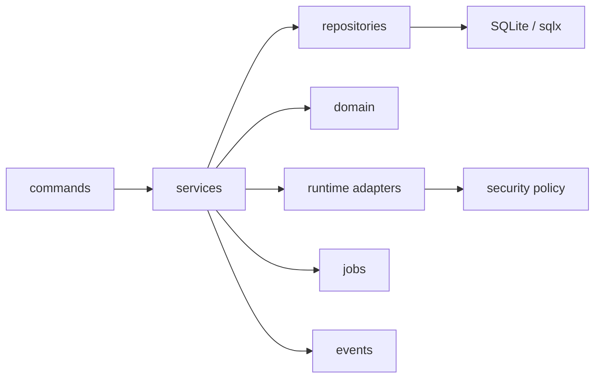
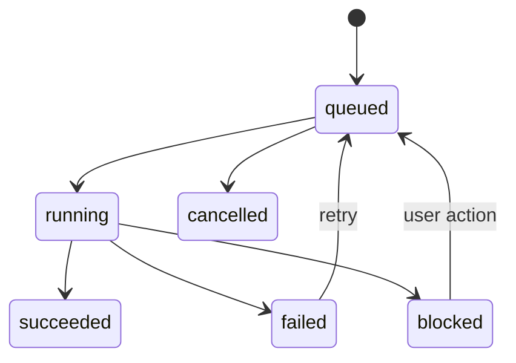

# Link World 后端架构规范

状态: Draft  
适用范围: Tauri v2 / Rust backend / Local Edition first

## 1. Purpose

本文档规定 Link World Rust 后端的工程模式。目标不是提前写复杂框架，而是防止 Tauri command、SQLite 访问、AI 调用、插件、后台任务和安全策略混在一起，导致后续无法维护。

后端实现必须满足：

- Tauri commands 只做参数校验、鉴权、调用 service、映射错误。
- 业务逻辑写在 service 层。
- SQL 写在 repository 层。
- 外部能力通过 provider / runtime adapter 接入。
- 所有耗时任务进入 job runner。
- 所有状态变更可审计、可追踪、可恢复。

## 2. Layering

```text
src-tauri/src/
├── main.rs
├── state.rs                 # AppState / dependency wiring
├── commands/                # Tauri IPC boundary
├── services/                # business use cases
├── repositories/            # sqlx queries and transactions
├── domain/                  # entities, value objects, state machines
├── jobs/                    # background job runner and handlers
├── events/                  # domain event outbox and dispatch
├── runtime/                 # model, plugin, sandbox, object store adapters
├── security/                # policy engine, secret store, audit
├── search/                  # FTS / vector indexing
├── errors.rs                # AppError and IPC mapping
└── telemetry/               # logs, metrics, redaction helpers
```

Dependency rule:



禁止：

- `commands/*` 直接写 SQL。
- `commands/*` 直接调用模型、插件或外部 HTTP。
- `repositories/*` 调用 service 或 Tauri API。
- `domain/*` 依赖 sqlx、reqwest、Tauri。
- 插件或 agent 绕过 service 直接访问 `SqlitePool`。

## 3. AppState and Dependency Injection

Tauri 全局状态通过 `AppState` 管理。所有长生命周期依赖在启动时构造并注入。

```rust
pub struct AppState {
    pub db: SqlitePool,
    pub http: reqwest::Client,
    pub job_runner: JobRunnerHandle,
    pub event_bus: DomainEventBus,
    pub model_registry: Arc<ModelProviderRegistry>,
    pub connector_registry: Arc<ConnectorRegistry>,
    pub parser_registry: Arc<ParserRegistry>,
    pub evaluator_registry: Arc<EvaluatorRegistry>,
    pub object_store: Arc<dyn ObjectStore>,
    pub secret_store: Arc<dyn SecretStore>,
    pub policy_engine: Arc<PolicyEngine>,
    pub audit: Arc<AuditService>,
}
```

Rules:

- `SqlitePool`、`reqwest::Client`、registry、secret store、object store 必须复用，不允许 command 内临时创建。
- `AppState` 只持有依赖，不承载业务状态。
- UI 选择态、当前对象 ID、窗口状态不得放进 Rust `AppState`。
- 后台任务通过 `JobRunnerHandle` 提交，不允许 command 自己 `tokio::spawn` 一条业务链路。


Startup has a separate `StartupState`:

- `StartupState::Ready` is managed alongside full `AppState` after database, object store, secret store and model registry initialize.
- `StartupState::Recovery` is managed when initialization fails before normal use. The window stays open, but normal `AppState` is absent and capture/AI background services are not started.
- `get_startup_status` exposes only ready/recovery mode, backend version, redacted message, error code, verified backup id and migration guard metadata.
- Commands that require normal library access must continue to depend on `AppState`; backup catalog and restore-preparation commands have explicit recovery-mode branches.
## 4. Command Boundary

Tauri command 是 IPC 边界，不是业务逻辑层。

Command responsibilities:

1. 反序列化请求。
2. 基础参数校验。
3. 调用 service。
4. 将 `AppError` 映射为 `IpcResponse<T>`。
5. 触发必要的 Tauri event 通知前端。

Command 禁止：

- 写 SQL。
- 拼 prompt。
- 修改生命周期状态。
- 读取 API key 明文。
- 直接执行 parser/evaluator。
- 长时间阻塞等待 AI 或网络任务完成。

Recommended pattern:

```rust
#[tauri::command]
pub async fn submit_capture(
    state: tauri::State<'_, AppState>,
    item: RawCaptureItemDto,
) -> IpcResponse<SubmitCaptureResponse> {
    map_ipc_result(async {
        validate_capture_item(&item)?;
        state.capture_service().submit(item).await
    }.await)
}
```

## 5. Service Layer

Service 层表达 use case。

Core services:

- `CaptureService`
- `LibraryService`
- `ParserService`
- `AiEnrichmentService`
- `EvaluationService`
- `SearchService`
- `PluginService`
- `SyncService`
- `MaintenanceService`
- `MigrationService`

Service responsibilities:

- 定义事务边界。
- 调用 repository。
- 触发 domain events。
- 提交 background jobs。
- 调用 policy engine。
- 调用 runtime adapters。
- 组织审计日志。

Service 禁止：

- 返回数据库原始行。
- 把 provider-specific 错误直接透给 UI。
- 捕获错误后静默吞掉。
- 绕过 lifecycle state machine。

## 6. Repository Layer

Repository 层只负责数据访问。

Rules:

- 每个 repository 只操作有限表集合。
- SQL 查询必须显式列字段，禁止 `SELECT *`。
- 复杂写入必须在 service 层开启 transaction，再把 `&mut Transaction` 传给 repository。
- Repository 不做业务判断，只返回 typed row 或 domain DTO。
- FTS、vector、cache 是派生索引，不得作为正文 source of truth。
- FTS ranking uses explicit field weights: title 8, author 3, parsed content 1 and latest AI summary 4. `object_id` and `parsed_document_id` remain unindexed identifiers. Search snippets must be derived from FTS at query time and suppressed for `secret` objects so result rows do not reveal secret body content.
- Search filter composition reuses Library navigation semantics: `inbox` means `captured` or `parsed`, `failed` means lifecycle failed, and other values are matched against `object_type`.
- Search index health checks are read-only and return counts plus capped object-id samples for missing, stale, orphaned and duplicate FTS rows. They must not return snippets, parsed text, AI summaries, URLs with query content or object bodies. Repair remains an explicit `rebuild_search_index` or `reindex_object` action.
- Full search-index rebuild uses a staged FTS table (`knowledge_fts_rebuild`) and publishes only through an atomic final swap. Progress is persisted in `background_jobs.payload_json` with `expectedObjects`, `indexedObjects`, `stage` and `cancellable`. The persisted UUID job id is the rebuild correlation id; reindex uses its generated operation/job UUID and persists it with the successful transaction. User cancellation is honored before `finalizing`; once finalizing begins, cancellation is disabled to avoid exposing a partially swapped index. Cancelled rebuilds preserve the previously published `knowledge_fts`. Rebuild failures persist only stable `search.rebuild_failed` recovery text, clean staging and converge to a failed response. SearchService maps query/rebuild/reindex/health database failures to stable `search.*` recovery text before IPC; raw SQLite errors never enter jobs, events, logs or IPC.

Recommended repositories:

- `KnowledgeObjectRepository`
- `SourceSnapshotRepository`
- `ParsedDocumentRepository`
- `AiAnalysisRepository`
- `AiTraceRepository`
- `EvaluationRepository`
- `JobRepository`
- `EventRepository`
- `PluginRepository`
- `AuditRepository`
- `SettingsRepository`

## 7. Transaction Boundaries

必须使用 transaction 的场景：

- 创建 `KnowledgeObject` + `domain_events`。
- 写入 `source_snapshots` + 更新 lifecycle。
- 写入 `parsed_documents` + 更新 lifecycle + FTS enqueue event。
- 写入 `ai_analysis`（包括可选 `display_hints_json`）+ `ai_traces` + 更新 lifecycle。
- 写入 `evaluation_runs` + artifacts + 更新 lifecycle。
- 删除对象 + tombstone + cleanup job。
- 插件权限变更 + audit log。

禁止一个 transaction 内：

- 发 HTTP 请求。
- 调用 LLM。
- 执行 parser 的重型 CPU 逻辑。
- 等待 sandbox。

外部调用必须在 transaction 之外完成，结果写入时再开启短事务。

## 8. Error Handling

统一错误类型使用 `AppError`。推荐组合：

- `thiserror` 用于定义可枚举业务错误。
- `anyhow` 仅允许在底层 adapter 内部临时聚合上下文，不允许穿透到 command boundary。

```rust
#[derive(thiserror::Error, Debug)]
pub enum AppError {
    #[error("backup invalid: {0}")]
    BackupInvalid(String),
    #[error("object not found: {0}")]
    #[error("restore invalid: {0}")]
    RestoreInvalid(String),
    ObjectNotFound(String),
    #[error("database constraint failed: {0}")]
    DbConstraint(String),
    #[error("network timeout")]
    NetworkTimeout,
    #[error("parse failed: {0}")]
    ParseFailed(String),
    #[error("model authentication failed")]
    ModelAuth,
    #[error("model output schema invalid: {0}")]
    ModelOutputSchema(String),
    #[error("policy denied: {0}")]
    PolicyDenied(String),
    #[error("plugin permission denied: {0}")]
    PluginPermission(String),
    #[error("secret storage error")]
    SecretStorage,
    #[error("unknown error")]
    Unknown,
}
```

Mapping to IPC:

| AppError | IpcErrorCode |
| --- | --- |
| `BackupInvalid` | `ERR_BACKUP_INVALID` |
| `RestoreInvalid` | `ERR_RESTORE_INVALID` |
| `ObjectNotFound` | `ERR_OBJECT_NOT_FOUND` |
| `DbConstraint` | `ERR_DB_CONSTRAINT` |
| migration failure | `ERR_DB_MIGRATION` |
| `NetworkTimeout` | `ERR_NETWORK_TIMEOUT` |
| `ParseFailed` | `ERR_PARSE_FAILED` |
| `ModelAuth` | `ERR_MODEL_AUTH` |
| model rate limit | `ERR_MODEL_RATE_LIMIT` |
| `ModelOutputSchema` | `ERR_MODEL_OUTPUT_SCHEMA` |
| `PolicyDenied` | `ERR_POLICY_DENIED` |
| `PluginPermission` | `ERR_PLUGIN_PERMISSION` |
| `SecretStorage` | `ERR_SECRET_STORAGE` |

Rules:

- 用户可恢复错误必须有 actionable message。
- 内部错误可以记录详细上下文，但 IPC 只返回脱敏摘要。
- 所有错误日志必须经过 redaction。
- 不允许 `.unwrap()` / `.expect()` 出现在业务路径中。

## 9. Async and Blocking Isolation

Tokio async 运行时不得被 CPU 密集工作阻塞。

Async:

- SQLite queries via sqlx。
- reqwest HTTP。
- model provider HTTP。
- object store async IO。
- Tauri IPC command。

Blocking / CPU-heavy:

- HTML readability extraction。
- Markdown chunking。
- large text normalization。
- hash large files。
- local embedding preprocessing。
- archive export compression。

Blocking work 必须使用：

```rust
tokio::task::spawn_blocking(move || {
    heavy_parse_or_chunking(input)
})
.await
```

Rules:

- 不允许在 async command 中直接执行大文本处理。
- 不允许在 Tokio worker 中同步读写大文件。
- spawn_blocking 中不得访问 `SqlitePool`，只返回纯数据结果。
- 每个 background job 必须有 timeout 或 cancellation point。

### 9.1 Capture and parser boundary

- URL 保存路径取得的原始 HTML，与浏览器扩展提交的已清洗 DOM，必须进入同一个 Rust `document_parser`。
- 浏览器扩展只负责当前页的主动采集和传输，不生成 Markdown，不实现站点专用排版规则。
- parser 统一产出 `text_content`、`markdown_content`、`parser_id` 和 `parser_version`；纯文本用于检索和 AI，Markdown 用于阅读展示。
- 用户主动提交的选中文本仍走显式 selection capture，不得被 DOM 正文自动覆盖。
- loopback capture endpoint 必须在创建 `RawCaptureItem` 前校验请求来源、URL scheme、payload 大小和 DOM 结构。
- 前端不接收或持久化 parser AST；AST 仅在渲染 Markdown 时临时派生。
- 手动 URL capture 在写入前按 normalized canonical URL 做幂等检查：忽略 fragment、规范化 host/default port；命中同一用户的非 deleted 对象时返回已有 object，不创建新的 snapshot/background job。DOM 与 selection capture 不参与该合并，因为它们可能代表同一页面的不同显式内容。
- URL fetch failure reasons must be stable and user-actionable. `capture.fetch_url` writes `failure_reason` with a `capture.*` prefix, including timeout, network unreachable, HTTP forbidden/not-found/retryable/server-error, restricted verification page, unsupported scheme, oversized page, invalid response and no-readable-text categories.
- Restricted pages, HTTP 401/403 and verification/CAPTCHA/challenge content must suggest browser extension capture instead of repeatedly retrying unauthenticated backend fetches.
- Network and parser error messages must not include raw response bodies, cookies, tokens or full third-party error payloads. Capture failures are converted to a stable `capture.*` reason before database, domain-event or frontend-event persistence; unrecognized policy and internal errors discard their original detail text.

## 10. Background Job Runner

所有耗时链路通过 `background_jobs` 表持久化。

Job lifecycle:



Job handler rules:

- Handler 必须幂等。
- Handler 开始时用 lock 字段抢占任务。
- Handler 完成后写入 domain event。
- Handler 失败时分类错误：retryable、blocked、terminal。
- Handler 不允许直接向 UI 发业务数据，只发状态事件。

- Startup must converge interrupted `running` jobs before normal background services are exposed:
  - `capture.fetch_url` with remaining retry budget returns to `queued` and clears lock fields.
  - `capture.fetch_url` with exhausted retry budget becomes `failed` and marks the object `failed`.
  - running jobs without a registered recovery runner become `failed` with a user-readable reason.
  - This prevents permanent `running` state after process crash or app restart.
Recommended handlers:

- `FetchUrlJobHandler`
- `SearchRebuildJobHandler`
- `ParseDocumentJobHandler`
- `AiEnrichObjectJobHandler`
- `CreateEmbeddingsJobHandler`
- `RunEvaluationJobHandler`
- `ReindexObjectJobHandler`
- `PurgeDeletedObjectJobHandler`

## 11. Domain Events and Outbox

所有关键状态变化写入 `domain_events`。Local Edition 可用 outbox pattern。

Rules:

- Service 在同一事务中写业务数据和事件。
- Event dispatcher 异步处理未处理事件。
- Event handler 必须根据 event id 幂等。
- 同一次 capture 的 submitted/snapshot/parsed/failed 事件共享提交时生成的 UUID correlation id；该 id 写入 background job payload，重启、retry 和终态事件继续使用同一值。
- Capture event payload 不复制 source/canonical URL；query/fragment 和正文只存在于受对应隐私策略保护的对象/快照存储。
- UI 通知可以来自事件，但事件不是 UI 专用机制。

Example:

```text
submit_capture
  transaction:
    insert knowledge_objects(status=captured)
    insert domain_events(capture.submitted)
  enqueue fetch_url job
```

## 12. Security and Policy Gates

所有以下操作必须先过 `PolicyEngine`：

- 第三方 AI 调用。
- 插件读取对象。
- 插件访问网络。
- browser automation。
- 导出 sensitive / secret 内容。
- 同步 sensitive 内容。
- 删除和 purge。

Policy decision 必须写入 audit log 或 AI trace metadata。

## 13. Model Provider Runtime

Model runtime 使用 capability-specific contract；当前落地 `TextGenerationProvider`，后续分别增加 embedding、rerank、vision contract：

- `chat`
- `embed`
- `rerank`
- `vision`

Rules:

- 业务层只依赖 capability，不依赖 vendor。
- config `id` 是稳定配置标识，`provider` 是供应商品牌，`api_family` 是线协议；registry 必须优先按协议分发。
- 内置 `genai` adapter 支持 `openai_chat_completions`、`openai_responses`、`anthropic_messages`、`google_generative_ai`、`ollama`。
- OpenAI-compatible provider 通过配置扩展；业务 service 不拼 endpoint、不构造 vendor-specific payload。
- Base URL 表示 API 根路径，例如 `https://api.openai.com/v1` 或 `http://127.0.0.1:11434`，不包含 `chat/completions`、`responses`、`messages` 等操作路径。
- API key 通过 `SecretStore` 临时读取，不返回给调用者；Windows production backend 使用 Credential Manager，测试使用进程内 memory backend。
- Repository 支持 list/save/delete/set-default；默认 Chat config id 存在 `local_settings`。历史未设置默认项时仅为兼容选择最新 enabled Chat 配置；一旦存在默认设置，失效时不得隐式 fallback；删除默认项写入空字符串哨兵，区别于历史记录缺失。
- 删除配置时 service 先删除 credential，repository 再以 transaction 删除配置和匹配的 default setting。
- 请求 payload 日志必须脱敏。
- Chat 输出 JSON 必须做 schema validation。
- Embedding dimensions 必须写入 `vector_chunks_meta.embedding_dimensions`。
- Provider 错误必须映射为 `AppError`。
- Command read model 只能包含 `hasApiKey` / `isDefault`，不得包含 `apiKey` 或 `secretRef`。
- Client 在 `AppState` 启动时构造并通过 `ModelProviderRegistry` 复用；请求 timeout 为 60 秒，可重试网络错误与 429/5xx，最多 3 次。
- `ai.enrich_object` failed jobs must persist sanitized stable `ai.*` failure reasons. Required categories include timeout, auth, rate limit, model not found, invalid output schema, policy denied, not configured, provider unavailable, secret storage and local persistence failure. Raw provider response bodies, prompts, object content and API keys must not appear in `last_error` or emitted failure payloads.

## 14. Plugin Runtime

MVP 插件是 in-process trait implementation，但必须按外部插件思路设计。

Rules:

- 插件只能通过 `PluginContext` 获取权限允许的数据。
- 插件不持有 `SqlitePool`。
- 插件不直接读取 secret。
- 插件输出必须带 plugin id/version。
- 插件异常不能 crash 主进程。
- 插件连续失败应自动禁用或进入 degraded 状态。

## 15. Backup and Restore Services

`BackupService` owns local restore-point creation and verification; `RestoreService` owns prepare/restart/apply/rollback:

- Database snapshot uses SQLite `VACUUM INTO`; copying the live main file is forbidden.
- Object files are copied in `spawn_blocking` with streaming SHA-256.
- `manifest.json` is versioned and protected by `manifest.sha256`.
- `.staging-<id>` is not visible as a completed backup; final publication is same-filesystem rename.
- Manifest paths are relative and reject parent/current/prefix components.
- Verification checks file size/hash, unexpected files, manifest identity and SQLite `quick_check`.
- Commands never accept arbitrary filesystem paths and never read credential values.
- `prepare_restore` re-verifies the target, creates a safety backup, copies a private candidate, runs migrations, `quick_check`, `foreign_key_check`, and regenerates the candidate manifest.
- A running process never replaces its own SQLite files. It writes a bounded pending marker and restarts.
- `AppState::initialize` applies pending restore before opening the pool or starting capture services.
- Phase markers (`prepared` → `moving-live` → `live-moved` → `candidate-installed`) make the two-path database/object switch crash recoverable.
- Restored storage is validated before rollback data is deleted; initialization failure closes the new pool, restores rollback payload, and reopens old storage.
- `get_restore_status` exposes only ids, status, timestamp and a sanitized message.
- Safety backups remain ordinary verified restore points and are never deleted automatically.
- `MigrationService` connects production SQLite without applying migrations, validates migration metadata, and creates a verified restore point before migrating any existing user schema.
- Migration guards transition `prepared` → `running`; a running guard with pending versions blocks automatic retry, while a committed migration with a stale guard converges after integrity validation.
- Fresh databases migrate without creating empty restore points. Migration guards contain only bounded identifiers/version metadata and never expose payloads or absolute paths.

- In startup recovery mode, backup catalog commands use `BackupCatalog` over app data backups and do not require `AppState`.
- `prepare_restore` can run in recovery mode by opening live SQLite without startup migration; if that temporary connection fails, recovery remains fail-closed.
- `create_backup` is intentionally disabled in recovery mode.
- `PortableExportService` owns Markdown/JSON directory export under app data `exports/`; clients do not provide output paths.
- Portable export depends on normal `AppState` and is disabled in startup recovery mode. It exports non-secret objects, omits credential reference, internal jobs, source snapshot storage URI and evaluation artifact storage URI.
- Export output is a portability artifact, not a restore point; it cannot be used by `RestoreService`.
Detailed semantics are defined in `docs/backup_and_restore.md`.

## 16. Object Store

对象存储负责 HTML、Markdown、截图、文件、evaluation artifact。

Rules:

- storage URI 使用抽象 scheme，例如 `local://objects/...`。
- 文件路径必须 canonicalize，防止 path traversal。
- 写入文件必须先写临时文件，再原子 rename。
- content hash 必须在写入后验证。
- 删除对象时 object store cleanup 必须由 purge job 执行。

## 17. Logging and Redaction

日志必须结构化。

Required fields:

- timestamp
- level
- module
- event
- object_id
- job_id
- error_code
- message

禁止记录：

- API key
- OAuth token
- cookie
- session
- 完整正文
- embeddings
- secret / sensitive 内容

所有外部错误进入日志前必须经过 redaction helper。

当前结构化 logger 写入 app data `logs/link-world.jsonl`，单文件上限 2 MiB、保留一份轮转文件、单条上限 4 KiB，并通过 AppState 共享写锁。entry 只接受受限的 level/module/event、内部 id、stable error code 和不含 URL/secret marker 的短消息；不接受 raw error/body。capture submit/fetch started/succeeded/failed 与 AI enrichment submitted/started/succeeded/failed 已接入；每次操作的 UUID 持久化到 job payload 并由 domain event、IPC result 和日志复用；repository 在完成/失败事务写入前校验 job object/correlation identity，不匹配则零部分写入地拒绝。search rebuild/reindex 也已接入，并以持久化 job UUID 同时作为 correlation id。startup migration 在 restore/storage 初始化前创建 logger，生成的 UUID 写入 `guard.prepared.json`、跨 `guard.running.json` 延续，并复制到 `last-result.json`；日志只使用 started/prepared/running/succeeded/failed 与稳定 `migration.*` code，legacy guard 使用原 UUID backup id 关联。restore 直接复用 `RestoreMarker.transaction_id`，由 prepare result、四阶段 pending marker、last-result 和日志跨重启共享；prepare/recovery/candidate/terminal 事件只写静态消息与稳定 `restore.*` code，target/safety backup ID、候选内容、路径和 raw error 不进入日志。日志失败为 best-effort，不得反向破坏已提交的业务事务。

Support bundle 使用独立于本地展示快照的导出 DTO。`export_support_bundle` 必须要求 command-level explicit confirmation，只能写入 app data 下固定的 `support-bundles` 目录，先写 staging 再原子 rename，并返回文件大小和 SHA-256。schema v1 只导出运行/schema 元数据、聚合健康、stable failed-job code、模型能力状态、插件 manifest SHA-256 指纹、不含 metadata payload 的 audit actions，以及不含 payload 的 domain event type/object/correlation/time；不得序列化本地绝对路径、raw job error、正文、URL query/fragment、credential reference 或 secret。runtime log reader 只接受通过同一 schema/redaction validator 的最近 100 条当前日志；读取失败时标记为 `unavailable`，不得把原始文件或解析错误打包。

## 18. Testing Requirements

Backend minimum test matrix:

- State machine: all lifecycle transitions including `failed`。
- Error mapping: every `AppError` maps to `IpcErrorCode`。
- Migration: empty DB；production migrator 生成的 0001/0002/0003 file fixtures；1000-object invariants；unknown future version fail-closed；existing-schema restore point；guard interruption convergence。
- Portable export: non-secret object markdown/metadata export, secret skip count, and storage URI / credential-reference omission.
- Support bundle: explicit confirmation, atomic local publication, valid schema/hash, bounded validated runtime logs, and adversarial omission of object bodies, job/domain-event payloads, audit metadata, plugin manifest secrets, URL query values, credential references and local absolute paths.
- Structured logging: JSONL round-trip, redaction rejection, size bounds and capture submit/start/success/failure correlation continuity.
- Capture transaction: object + event + job。
- Startup recovery: redacted startup status, backup id extraction, restricted backup/restore command availability。
- Parse pipeline: snapshot + parsed_documents + event。
- AI pipeline: ai_analysis + optional display hints + ai_traces；无效提示不得导致主体分析失败，`reason` 最多保留 160 个字符。
- Evaluation: run + artifacts + evidence JSON。
- Deletion: tombstone + cleanup job + search invisibility。
- Backup: atomic staging publication + manifest/file hashes + SQLite quick_check + tamper detection。
- Restore: candidate migration + safety backup + restart boundary；四个 phase 中断；copy hash race；duplicate prepare；missing rollback payload；injected database failure rollback。
- Policy: sensitive object denies third-party AI without authorization。
- Job idempotency: repeated event/job does not duplicate derived rows。

## 19. Implementation Checklist

Before implementing a new backend feature:

- Define DTO in `api_contracts.ts` if it crosses IPC.
- Define domain type and state transition.
- Decide service and repository ownership.
- Decide transaction boundary.
- Decide domain event.
- Decide audit requirement.
- Decide whether it is job-based.
- Add error mapping.
- Add tests for success, failure, retry and permission denied.
