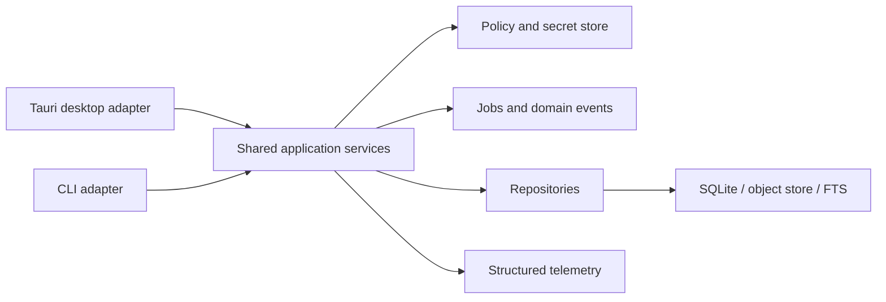

# Link World CLI 开发计划

状态：Proposed  
创建日期：2026-07-03  
目标阶段：Windows Local Alpha 稳定后  
关联决策：[ADR-0008](./adr/0008-shared-core-for-desktop-and-cli.md)

## 1. 目的

Link World CLI 的目标是让可重复、可批处理和可自动化的核心能力脱离 GUI 使用，并为脚本、CI 和后续 Agent/MCP 接入提供稳定边界。CLI 不是另一套业务实现，也不以机械复制每个界面按钮为目标。

首期成功标准：

- 桌面端与 CLI 调用同一套 Rust service、repository、policy 和 telemetry。
- 人类可读输出适合终端，`--output json` 具有版本化、可测试的机器契约。
- CLI 不绕过隐私策略、凭据存储、任务状态机、审计或结构化日志。
- 对同一数据目录的并发访问有确定性策略，不因桌面端与 CLI 同时运行破坏数据。
- 核心自动化场景可在无图形界面的 Windows 环境中完成。

## 2. 范围与非目标

### 2.1 首期范围

- 版本、运行状态和脱敏诊断。
- 对象列表、元数据查看和搜索。
- URL capture 提交及 job 状态查询。
- AI enrichment 与 Evaluation 的触发、查询和失败重试。
- 搜索索引健康检查及受控重建。
- 便携导出与备份的非交互安全入口。
- 稳定退出码、JSON 输出、shell completion 和隐私边界测试。

### 2.2 首期非目标

- 100% GUI 功能对等。
- 在 CLI 中实现阅读器、拖拽、布局、可视化预览或复杂设置向导。
- 通过命令参数传递 API Key、cookie、session、正文或其他 secret。
- 把 Tauri IPC command 当作 CLI 内部 API，或在 CLI 中复制 command 业务逻辑。
- 首期引入常驻 daemon、本地 HTTP 管理端口或远程控制正在运行的桌面进程。
- 首期提供 Cloud Edition、账号、同步、团队或远程执行能力。
- 默认把完整对象正文输出到终端、管道或日志。

## 3. 架构方案

### 3.1 目标结构



推荐工程布局：

```text
src-tauri/src/
├── bin/
│   └── link-world-cli.rs       # 独立 console binary
├── cli/
│   ├── mod.rs                  # 参数解析与 dispatch
│   ├── output.rs               # text/json 输出与 schema version
│   └── exit.rs                 # AppError 到稳定退出码
├── commands/                   # 仅 Tauri IPC adapter
├── services/                   # GUI/CLI 共享 use cases
├── state.rs                    # 共享依赖装配，不承载 CLI 交互
└── ...
```

Windows 首期二进制名使用 `link-world-cli.exe`。当前桌面宿主已经占用 `link-world.exe`，不能在同一安装目录发布同名文件。是否在后续版本提供 `lw` 或 `link-world` shell alias，须经过安装、冲突和升级验证后决定。

### 3.2 共享核心规则

- CLI adapter 只负责参数解析、输入校验、调用 service、等待策略、输出格式和退出码映射。
- CLI 不直接执行 SQL，不直接写对象存储，不直接调用 provider，也不构造领域状态。
- Tauri command 与 CLI adapter 可以共享输入 DTO 和 application facade，但不能互相调用。
- 为 CLI 暴露的 use case 若仍依赖 `tauri::AppHandle`、窗口或事件 API，必须先拆出纯 Rust application service。
- 默认数据目录沿用桌面端的 Tauri app data 位置；测试使用显式临时目录。生产版首期不开放任意 `--data-dir`，避免误操作其他目录或绕过恢复边界。

### 3.3 进程与数据目录互斥

首期采用单运行者策略：桌面端和 CLI 初始化同一数据目录前必须取得跨进程 runtime lock。该限制比 SQLite 的单写入者要求更严格，但能同时覆盖数据库、对象存储、migration、restore 和后台任务。

- 已有进程持锁时，另一进程立即返回 `ERR_RUNTIME_BUSY`，不得等待后偷取锁。
- migration、restore、backup 发布、FTS rebuild 和对象写入均在锁保护范围内。
- 异常退出后锁必须可安全回收；不能仅依赖一个永不清理的 marker 文件。
- 帮助、版本和 shell completion 不需要打开数据目录，也不需要取得锁。
- 首期不承诺桌面端运行时同时执行 CLI。后续若该限制影响真实工作流，再评估 daemon/IPC client 模式。

## 4. 命令面设计

命令命名使用名词分组和显式动词；所有 ID 参数必须经过既有 identifier/UUID 校验。

```text
link-world-cli version
link-world-cli status [--output text|json]
link-world-cli diagnostics show [--output text|json]

link-world-cli object list [--type TYPE] [--limit N] [--cursor CURSOR]
link-world-cli object show <OBJECT_ID> [--include-content]
link-world-cli object delete <OBJECT_ID> --yes

link-world-cli search <QUERY> [--type TYPE] [--limit N]
link-world-cli capture url <URL> [--request-id UUID] [--wait]

link-world-cli analysis run <OBJECT_ID> [--request-id UUID] [--wait]
link-world-cli evaluation list
link-world-cli evaluation run <OBJECT_ID> <EVALUATOR> [--request-id UUID] [--wait]
link-world-cli evaluation show <RUN_ID>
link-world-cli evaluation retry <RUN_ID> [--request-id UUID] [--wait]

link-world-cli job show <JOB_ID>
link-world-cli job retry <JOB_ID> [--wait]

link-world-cli search-index check
link-world-cli search-index rebuild [--wait]
link-world-cli search-index cancel <JOB_ID>

link-world-cli export library --format json|markdown --yes
link-world-cli backup create
link-world-cli backup list
link-world-cli backup verify <BACKUP_ID>
```

首期不开放 `restore apply`。恢复涉及候选验证、safety backup、进程重启和 rollback，继续由桌面 recovery UI 承担。只有在 CLI 能表达同等级显式确认、阶段结果和故障恢复后，才能单独立项加入。

## 5. 输出、退出码与异步语义

### 5.1 输出约定

- `stdout` 只写命令结果；提示、进度和诊断写 `stderr`。
- `--output text` 面向人类，允许在不破坏语义的前提下优化排版。
- `--output json` 输出单个合法 JSON document，不混入 banner、spinner 或颜色控制符。
- JSON 顶层必须包含 `schemaVersion`、`ok`、`command`、`data` 或 `error`。
- JSON 字段只做向后兼容添加；删除、改名或改变含义必须提升 schema version。
- `--quiet` 只抑制非必要进度，不得抑制错误或改变退出码。
- object detail 默认只返回元数据和摘要；`--include-content` 是显式隐私升级，并在交互式终端提示内容可能进入 shell history、重定向文件或 CI 日志。

### 5.2 稳定退出码

| Code | 含义 |
| --- | --- |
| 0 | 成功 |
| 2 | 参数或输入校验失败 |
| 3 | 对象、job、run 或 backup 不存在 |
| 4 | policy/隐私/权限拒绝 |
| 5 | runtime busy 或当前启动模式不允许 |
| 6 | 可重试的网络/provider 失败 |
| 7 | 持久化、migration、restore 或完整性失败 |
| 8 | job 已提交但 `--wait` 超时；结果状态仍可查询 |
| 10 | 未分类内部错误 |

错误 JSON 只包含稳定 `code`、安全 `message`、可选 `correlationId` 和 `retryable`，不得包含 raw provider/SQLite error、绝对路径、请求正文或 secret。

### 5.3 异步操作

- 默认提交后台操作后立即返回 object/job/run/correlation ID。
- `--wait` 只轮询持久化状态，不在 adapter 中复制任务执行逻辑。
- 等待必须有有界默认超时，可通过受限参数调整；超时不取消已经提交的任务。
- 可幂等写操作接受 `--request-id UUID`；缺省时由 CLI 生成并在结果中返回。
- Ctrl+C 只停止本地等待。除非命令本身具有显式 cancel 语义，不得把终端中断偷偷映射为业务取消。

## 6. 安全、隐私与可观测性

- API Key 继续只通过 Windows Credential Manager/`SecretStore` 管理；禁止 `--api-key VALUE`。
- 若未来增加 secret 写入，值只能从交互式隐藏输入或 stdin 读取，禁止回显、日志和 JSON 返回。
- URL、query、正文、prompt、模型输出、credential reference 和 raw error 不进入结构化日志。
- CLI 复用现有 correlation id；adapter 可增加静态的 CLI lifecycle event，但不能复制业务 payload。
- destructive command 必须要求交互确认；非交互环境只能用显式 `--yes`，不能从默认配置永久关闭确认。
- `--output json` 不代表允许扩大数据披露；字段仍受现有 DTO 和 policy 限制。
- 支持包导出继续要求 command-level explicit confirmation，并沿用固定安全目录和原子发布规则。

## 7. 分阶段实施

### Phase 0：契约与共享核心准备

交付：

- 接受 ADR-0008，确认独立 binary、共享 service 和首期互斥策略。
- 盘点现有 Tauri commands，形成 GUI → service → CLI 的能力映射表。
- 抽离仍依赖 Tauri window/handle 的业务装配代码。
- 建立跨进程 runtime lock、稳定 exit code 和 JSON envelope。
- 评审参数解析依赖；若采用 `clap`，完成许可证、RustSec、体积和维护状态检查。

验收：

- CLI skeleton 可执行 `version`、`help` 和 completion，且不打开数据库。
- 桌面端和 CLI 共享初始化测试；同一数据目录并发启动稳定返回 `ERR_RUNTIME_BUSY`。
- CLI crate/binary 不依赖 React 或 Tauri window API。

### Phase 1：只读闭环

交付：

- `status`、`diagnostics show`、`object list/show`、`search`、`job show`。
- text/json renderer、分页 cursor 和稳定错误映射。
- 默认不输出正文、绝对数据路径或 secret metadata。

验收：

- CLI 与 GUI 对相同 fixture 的对象、搜索和 job read model 语义一致。
- JSON schema snapshot、空库、损坏输入、非 ASCII 目录和大结果分页测试通过。
- stdout/stderr 分离，JSON 模式可直接被 PowerShell 解析。

### Phase 2：受控写入与后台任务

交付：

- capture、AI enrichment、Evaluation、job retry。
- request UUID 幂等、`--wait`、超时和 Ctrl+C 语义。
- 对象删除的显式确认与一致的 audit/domain event/log 行为。

验收：

- CLI 与 GUI 触发同一 use case 时产生相同状态机、job payload 边界和 correlation 链路。
- 重复 request ID 不产生重复对象、run 或 artifact；跨 identity 复用 fail closed。
- 网络失败、模型未配置、policy denied 和进程中断均返回稳定、安全结果。

### Phase 3：维护、导出与发布

交付：

- 索引检查/重建/取消、便携导出、backup create/list/verify。
- PowerShell completion、独立签名 artifact、安装器 PATH 选项和升级策略。
- CLI readiness 脚本与真实 Windows 矩阵。

验收：

- CLI artifact 可在无 GUI session 的 Windows 环境启动。
- 安装、升级、卸载不会覆盖桌面 executable、用户数据或 shell 配置。
- 维护操作故障注入不发布半成品索引、导出或 backup。
- 签名、checksum、依赖审计和隐私扫描进入发布证据。

### Phase 4：Agent/MCP 评估（独立决策）

只有 Phase 1–3 的机器契约稳定后再评估：

- MCP server 是直接调用 application service，还是受控调用 CLI JSON contract。
- 每项 tool 的读取/写入/外部网络/AI 成本和用户确认级别。
- 长任务进度、取消、权限提示和审计模型。

MCP 不得通过 shell 字符串拼接绕过 typed validation，也不得因为面向 Agent 而扩大默认数据披露。

## 8. 测试与发布门禁

最低自动化：

- 参数解析与 help snapshot。
- text/json 输出 schema、stdout/stderr 和退出码测试。
- shared service parity integration tests。
- runtime lock、崩溃回收和双进程竞争测试。
- migration/restore guard 与 recovery mode 测试。
- capture/search/AI/evaluation/job 的幂等和失败分类测试。
- secret、正文、URL query、绝对路径和 raw error 诱饵扫描。
- PowerShell 管道、UTF-8、中文用户目录和重定向测试。
- signed release artifact 的安装、升级、PATH、卸载和 checksum 验证。

建议增加：

```text
npm run readiness:cli
```

该命令应生成 JSON report，记录版本、命令、退出码、耗时和经过脱敏的有限日志尾部。真实 Windows 进程竞争、安装器 PATH 和签名仍需单独发布矩阵，不能由单进程自动化替代。

## 9. 完成定义

CLI 首期只有同时满足以下条件才能标记为完成：

- Phase 0–3 的命令、契约、测试和发布矩阵均通过。
- 没有 CLI 专属业务逻辑、SQL 或 provider 调用。
- GUI/CLI parity fixture 没有语义漂移。
- runtime lock、幂等、隐私和 destructive confirmation 经过自动化与真实 Windows 验证。
- 文档索引、总体架构、后端边界、测试策略、DevOps/CI 和发布证据已同步。
- 已知限制明确写入 `--help` 和用户文档，尤其是桌面端与 CLI 首期不能同时打开同一数据目录。

## 10. 实施前待确认事项

以下问题不阻塞本文档进入 Proposed，但必须在 Phase 0 结束前定案：

1. CLI 是随桌面安装器默认安装，还是作为独立可选 artifact 发布。
2. Windows shell command 最终保留 `link-world-cli`，还是额外提供经过冲突验证的短 alias。
3. `clap` 是否满足依赖治理要求，或使用更小的参数解析方案。
4. 哪些 read model 需要抽成与 Tauri DTO 无关的 application DTO。
5. Alpha 用户是否真的需要桌面端运行时并发调用 CLI；若需要，应另立 daemon/IPC ADR，不扩大首期实现。
