# Link World DevOps、CI 与打包分发规范

状态: Draft  
适用范围: Tauri desktop app / Rust backend / React frontend

## 1. Purpose

本文档定义 Link World 的自动化测试、构建、打包、签名、发布和回滚标准。MVP 可以先只做 Windows 本地开发，但工程设计必须为跨平台和商业发布预留清晰路径。

目标：

- 每次提交都能验证核心质量门槛。
- 数据库 migration 不破坏用户数据。
- Tauri 打包可重复、可追踪。
- 发布 artifact 可签名、可回滚。
- 诊断信息可帮助定位问题且不泄漏隐私。

## 2. CI Pipeline Overview

Recommended stages:

```mermaid
flowchart LR
  Checkout["Checkout"] --> Setup["Setup toolchains"]
  Setup --> Lint["Lint / Format"]
  Lint --> Typecheck["Typecheck"]
  Typecheck --> Unit["Unit tests"]
  Unit --> Integration["Integration tests"]
  Integration --> Build["Build"]
  Build --> Package["Package"]
  Package --> Sign["Code signing"]
  Sign --> Release["Release artifacts"]
```



MVP CI can start with:

- frontend typecheck。
- frontend lint。
- Rust fmt。
- Rust clippy。
- Rust unit tests。
- SQLite migration test。

Packaging and signing can be added once Tauri scaffold exists.

## 3. Build Matrix

Target matrix:

| Platform | Runner | Package | Priority |
| --- | --- | --- | --- |
| Windows 11 | `windows-latest` | `.msi` / `.exe` | MVP primary |
| macOS Apple Silicon | `macos-latest` | `.dmg` | Later |
| macOS Intel | `macos-13` | `.dmg` | Later |
| Linux x64 | `ubuntu-latest` | AppImage / deb | Later |

Rules:

- Windows is the first release target.
- macOS builds require signing and notarization before public distribution.
- Linux package format can be deferred until demand is clear.
- Build scripts must not assume absolute local paths.

## 4. Required Checks

### 4.1 Frontend

- `npm run typecheck`
- `npm run lint`
- `npm run test`
- production build

Quality gates:

- TypeScript strict mode no errors。
- No `any` in new code unless locally justified。
- No direct `invoke` outside `hooks/commands`。
- No direct DB/file/secret access from frontend。
- Startup recovery UI tests must verify restricted mode hides create_backup and preserves explicit restore confirmation.

### 4.2 Rust

- `cargo fmt --check`
- `cargo clippy --all-targets -- -D warnings`
- `cargo test`
- migration integration tests

Quality gates:

- No `unwrap()` / `expect()` in business path。
- Every public command maps errors to `IpcErrorCode`。
- No secret or正文 in logs。
- `failed` lifecycle covered。

### 4.3 Database

Migration tests:

- Empty DB -> latest schema。
- Generated 0001/0002/0003 fixture DB -> latest schema, using production SQLx checksums。
- Unknown future migration -> fail closed without rewriting user rows。
- Restore phase interruption and rollback I/O fault matrix。
- Pending ordinary startup migration creates a verified restore point before live migration; fresh DB skips backup, interrupted running guard blocks retry, and committed migration converges on next startup。（4 个自动化用例已实现；真实安装升级仍是发布门禁）
- Startup recovery state redacts app data paths, surfaces verified backup id, and keeps normal AppState/background services unavailable until recovery succeeds.
- Deletion purge removes FTS/vector/derived rows。
- Portable export writes non-secret Markdown/JSON artifacts and verifies that metadata excludes credential references, internal jobs and local storage URI fields。

- Startup job recovery converges interrupted `running` jobs so app restart cannot leave permanent running jobs.
- Capture fetch failure classification covers timeout, unreachable network, HTTP forbidden, restricted verification pages, unsupported schemes and no-readable-text cases without logging raw response bodies; job isolation coverage verifies one failed fetch does not block a later queued URL job.
Test DB strategy:

- Unit tests can use in-memory SQLite when possible。
- Migration tests should also run against a temp file DB because WAL、FTS5、sqlite-vec behavior may differ from memory。
- Sprint 2 readiness automation: `npm run readiness:sprint2` runs the focused backup/migration/restore/export/redaction gate and writes a JSON report to the system temp directory unless `-OutputPath` is supplied. This is the default local pre-release gate for data safety, but it does not replace the real Windows installer fault matrix in `docs/sprint2_windows_fault_matrix.md`.
- Sprint 3 readiness automation: `npm run readiness:sprint3` runs capture parsing/failure/redaction, job convergence/isolation and AI failure mapping gates. It does not replace real offline/DNS, external HTTP, forced-process-termination or concurrent capture checks in `docs/sprint3_capture_fault_matrix.md`.
- Focused commands: `cargo test storage::database::migration_tests` and `cargo test services::restore`。
- Function-level phase simulation belongs in normal CI; real-process kill tests belong in the Windows packaging matrix。
- Focused command: `cargo test repositories::jobs` for retry and startup-running-job convergence.
- Focused command: `cargo test services::capture` for parser reuse and capture failure classification.
- Focused command: `cargo test repositories::search::tests::search_benchmark_fixture_supports_repeatable_corpus` for the CI-safe search benchmark smoke.
- Manual pre-release search benchmarks:
  - `cargo test repositories::search::tests::search_benchmark_5k_objects_reports_budget -- --ignored --nocapture`
  - `cargo test repositories::search::tests::search_benchmark_20k_objects_reports_budget -- --ignored --nocapture`
  - 5k budget: max single query <= 250ms; 20k budget: max single query <= 500ms.

## 5. GitHub Actions Draft

This is a design sketch, not a committed workflow.

```yaml
name: ci

on:
  pull_request:
  push:
    branches: [main]

jobs:
  frontend:
    runs-on: ubuntu-latest
    steps:
      - uses: actions/checkout@v4
      - uses: actions/setup-node@v4
        with:
          node-version: 20
          cache: npm
      - run: npm ci
      - run: npm run typecheck
      - run: npm run lint
      - run: npm run test
      - run: npm run build

  rust:
    runs-on: windows-latest
    steps:
      - uses: actions/checkout@v4
      - uses: dtolnay/rust-toolchain@stable
      - run: cargo fmt --check
        working-directory: src-tauri
      - run: cargo clippy --all-targets -- -D warnings
        working-directory: src-tauri
      - run: cargo test
        working-directory: src-tauri
```

The final workflow must be adjusted after project scaffold exists.

## 6. Packaging Strategy

Tauri packaging requirements:

- package version matches app version。
- schema version recorded in build metadata。
- build output includes platform, arch, commit SHA, build time。
- app permissions use least privilege。
- local data directory is not inside install directory。
- updater disabled until signing and release flow are stable。

Windows:

- Build `.msi` or `.exe` installer。
- Ensure uninstall does not delete user data by default。
- Provide explicit “remove local data” option later。

macOS:

- `.dmg` package。
- Developer ID certificate。
- Notarization。
- Hardened runtime where applicable。

Linux:

- AppImage first, deb later if needed。

## 7. Code Signing

Signing is required before public commercial distribution.

Windows:

- EV or OV code signing certificate。
- Store certificate in CI secret manager or dedicated signing service。
- Never commit certificate or password。
- Signed installer and signed executable。

macOS:

- Apple Developer Program。
- Developer ID Application certificate。
- Notarization credentials。
- Staple notarization ticket。

Placeholder variables:

- `WINDOWS_CERTIFICATE`
- `WINDOWS_CERTIFICATE_PASSWORD`
- `APPLE_ID`
- `APPLE_TEAM_ID`
- `APPLE_APP_SPECIFIC_PASSWORD`

## 8. Release Channels

Recommended channels:

- `dev`: internal only。
- `alpha`: early testers, manual update。
- `beta`: signed builds, migration warnings。
- `stable`: signed, documented, rollback plan。

Versioning:

- Semantic versioning for app。
- Separate schema migration version。
- Prompt template version。
- Plugin interface version。

## 9. Release Checklist

Before release:

- CI green。
- Migration tests green。
- Manual smoke test on clean Windows machine。
- No secret in logs。
- Add URL works。
- Failed parse UI works。
- Model config works。
- AI trace written。
- Evaluation writes result。
- Search works。
- Delete and purge works。
- Diagnostics package is redacted。
- Release notes include migration risk。

## 10. Rollback Strategy

Rollback constraints:

- App binary can roll back only if database schema remains compatible。
- Destructive migrations must be avoided。
- Before major migration, create backup/restore point。
- If migration succeeds but app fails, user must be able to export diagnostics and restore previous DB。

Rollback policy:

- Patch versions should be backward compatible with same schema。
- Minor versions can add tables/columns。
- Major versions may require explicit migration confirmation。

## 11. Test Fixtures

Required fixtures:

- Empty DB。
- DB with 1000 objects。
- DB with failed jobs。
- DB with sensitive object。
- DB with source snapshots and parsed documents。
- DB with AI analysis and trace。
- DB with evaluation artifact。
- Previous schema version DB。

Fixtures must not contain real user content or real API keys.

## 12. Security Scans

Recommended checks:

- npm audit or equivalent with severity policy。
- cargo audit。
- secret scanning。
- dependency license review。
- Tauri permission review。

Do not block all releases on low-severity advisories, but high/critical issues in shipped runtime dependencies require explicit approval.

## 13. Artifact Retention

CI should retain:

- test reports。
- build logs。
- installers。
- checksums。
- symbols/debug metadata if applicable。

Retention policy:

- PR artifacts: short retention。
- release artifacts: long retention。
- signed stable releases: permanent archive。

## 14. Diagnostics Package

Target diagnostics package generated by app or CI must include:

- app version、OS/architecture 和 schema version。
- feature flags。
- aggregate health and stable failed-job codes。
- sanitized plugin manifest metadata/fingerprints。
- redacted structured runtime logs with correlation id once logging is implemented。

Current app-generated schema v1 requires explicit confirmation, writes one atomic JSON file below app data `support-bundles`, returns size/SHA-256, includes safe audit actions plus payload-free domain event correlation summaries, and records runtime logs as `not_collected`. Therefore support-bundle export is implemented, while the separate structured logging/correlation-id deliverable remains open.

Must not include:

- API keys。
- tokens。
- cookies。
- sessions。
- source snapshots。
- parsed document正文。
- embeddings。
- URL query/fragment、credential reference 或本机绝对路径。

## 15. Implementation Timing

MVP immediate:

- local scripts for typecheck/lint/test。
- Rust migration tests。
- Windows dev build。

Before first external alpha:

- GitHub Actions CI。
- Windows packaging。
- diagnostic package。

Before paid/commercial beta:

- code signing。
- migration rollback test。
- release channels。
- security scans。
