# Node Tide DevOps、CI 与打包分发规范

状态: Draft  
适用范围: Tauri desktop app / Rust backend / React frontend

## 1. Purpose

本文档定义 Node Tide 的自动化测试、构建、打包、签名、发布和回滚标准。MVP 可以先只做 Windows 本地开发，但工程设计必须为跨平台和商业发布预留清晰路径。

目标：

- 每次提交都能验证核心质量门槛。
- 数据库 migration 不破坏用户数据。
- Tauri 打包可重复、可追踪。
- 发布 artifact 可签名、可回滚。
- 诊断信息可帮助定位问题且不泄漏隐私。

工具链基线：

- 前端构建支持 Node.js 20.19+、22.13+ 或 24+；CI 固定使用 Node.js 20.19，发布候选必须满足 `package.json` 的同一引擎契约。
- `package.json` 的 `engines.node` 是安装期契约，`readiness:alpha` 会在运行前执行同等版本检查并把 Node/npm 版本写入报告。
- 不得把开发机 PATH 中的旧 Node 运行结果作为代码失败；发布证据必须记录实际工具链版本并在受支持运行时重新执行。

## 2. CI Pipeline Overview

Recommended stages:

```mermaid
flowchart LR
  Checkout["Checkout"] --> Setup["Setup toolchains"]
  Setup --> Lint["Lint / Format"]
  Lint --> Typecheck["Typecheck"]
  Typecheck --> Unit["Unit tests"]
  Unit --> Integration["Integration tests"]
  Integration --> Build["Build"]
  Build --> Package["Package"]
  Package --> Sign["Code signing"]
  Sign --> Release["Release artifacts"]
```

MVP CI can start with:

- frontend typecheck。
- frontend lint。
- Rust fmt。
- Rust clippy。
- Rust unit tests。
- SQLite migration test。

Packaging and signing can be added once Tauri scaffold exists.

## 3. Build Matrix

Target matrix:

| Platform | Runner | Package | Priority |
| --- | --- | --- | --- |
| Windows 11 | `windows-latest` | `.msi` / `.exe` | MVP primary |
| macOS Apple Silicon | `macos-latest` | `.app` / `.dmg` | Alpha expansion |
| macOS Intel | `macos-13` | `.app` / `.dmg` | Compatibility matrix |
| Linux x64 | `ubuntu-latest` | AppImage / deb | Later |

Rules:

- Windows remains the first fully validated release target.
- macOS builds must run on macOS hosts and require Developer ID signing plus notarization before public distribution.
- Linux package format can be deferred until demand is clear.
- Build scripts must not assume absolute local paths.

## 4. Required Checks

### 4.1 Frontend

- `npm run typecheck`
- `npm run lint`
- `npm run test`
- production build

Quality gates:

- TypeScript strict mode no errors。
- No `any` in new code unless locally justified。
- No direct `invoke` outside `hooks/commands`。
- No direct DB/file/secret access from frontend。
- Startup recovery UI tests must verify restricted mode hides create_backup and preserves explicit restore confirmation.

### 4.2 Rust

- `cargo fmt --check`
- `cargo clippy --all-targets -- -D warnings`
- `cargo test`
- migration integration tests

Quality gates:

- No `unwrap()` / `expect()` in business path。
- Every public command maps errors to `IpcErrorCode`。
- No secret or正文 in logs。
- `failed` lifecycle covered。
- `npm run readiness:cli` passes with JSON report retained whenever CLI/shared-service/runtime-lock code changes。

### 4.3 Database

Migration tests:

- Empty DB -> latest schema。
- Generated 0001/0002/0003 historical fixture DB -> current 0007 schema, using production SQLx checksums。
- Unknown future migration -> fail closed without rewriting user rows。
- Restore phase interruption and rollback I/O fault matrix。
- Pending ordinary startup migration creates a verified restore point before live migration; fresh DB skips backup, interrupted running guard blocks retry, and committed migration converges on next startup。（4 个自动化用例已实现；真实安装升级仍是发布门禁）
- Startup recovery state redacts app data paths, surfaces verified backup id, and keeps normal AppState/background services unavailable until recovery succeeds.
- Deletion purge removes FTS/vector/derived rows。
- Portable export writes non-secret Markdown/JSON artifacts and verifies that metadata excludes credential references, internal jobs and local storage URI fields。

- Startup job recovery converges interrupted `running` jobs so app restart cannot leave permanent running jobs.
- Capture fetch failure classification covers timeout, unreachable network, HTTP forbidden, restricted verification pages, unsupported schemes and no-readable-text cases without logging raw response bodies; job isolation coverage verifies one failed fetch does not block a later queued URL job.
Test DB strategy:

- Unit tests can use in-memory SQLite when possible。
- Migration tests should also run against a temp file DB because WAL、FTS5、sqlite-vec behavior may differ from memory。
- Sprint 2 readiness automation: `npm run readiness:sprint2` runs the focused backup/migration/restore/export/redaction gate and writes a JSON report to the system temp directory unless `-OutputPath` is supplied. This is the default local pre-release gate for data safety, but it does not replace the real Windows installer fault matrix in `docs/sprint2_windows_fault_matrix.md`.
- Sprint 3 readiness automation: `npm run readiness:sprint3` runs capture parsing/failure/redaction, job convergence/isolation and AI failure mapping gates. It does not replace real offline/DNS, external HTTP, forced-process-termination or concurrent capture checks in `docs/sprint3_capture_fault_matrix.md`.
- Sprint 5 readiness automation: `npm run readiness:sprint5` runs local diagnostics/redaction, bounded logger/rotation, support-bundle privacy/atomicity, capture/AI correlation boundaries, search rebuild/reindex correlation/cancellation/atomic failure cleanup/stable error redaction, startup migration correlation/fail-closed redaction, and restore restart/rollback correlation/redaction gates. It does not replace user-confirmation, installed Windows path/permission, live rotation, 100-failed-job UI or support-handoff checks in `docs/sprint5_observability_readiness.md`.
- Week 9/10 Alpha readiness automation: `npm run readiness:alpha` first enforces the supported Node.js range, then runs the local pre-release aggregate gate for frontend typecheck/tests/build, Rust fmt/check/test/clippy, release metadata and dependency inventory. The JSON report records the Node/npm versions used. `scripts/alpha-readiness.ps1 -IncludeSprintGates -IncludeTauriBuild -IncludeNetworkAudits` additionally runs Sprint 2/3/5 gates, Tauri packaging and network-backed audit commands where available. It does not replace the Windows installer matrix in `docs/windows_alpha_release_matrix.md` or the invited-user feedback evidence in `docs/alpha_feedback_playbook.md`.
- CLI readiness automation: `npm run readiness:cli` checks all-target compilation, parser/JSON/exit contracts, shared-service capture flow, request identity, non-ASCII paths, privacy redaction, live runtime lock contention, export/backup and user-level install/remove. It writes an atomic JSON report but does not replace `docs/cli_windows_release_matrix.md`.
- RustSec 审计必须从 `src-tauri` 执行，以 `src-tauri/Cargo.lock` 作为发布候选的实际锁定依赖图；在仓库根目录找不到 lockfile 不能被记录为“无漏洞”。
- 完整 Windows 门禁通过后运行 `scripts/package-alpha-release.ps1 -ReadinessReport <report>` 或 `npm run package:windows`；脚本拒绝脏工作区、失败报告、报告 commit 与 HEAD 不一致，以及缺失 MSI/NSIS/CLI/CLI installer 工件，并生成规范化文件名、release manifest、Authenticode 状态和 `SHA256SUMS.txt`。
- macOS 候选包在 macOS host 上运行 `npm run tauri:build:macos`、`npm run build:cli`、`npm run package:macos`；脚本拒绝脏工作区、失败报告、报告 commit 与 HEAD 不一致，以及缺失 `.app`、`.dmg`、CLI 或 CLI metadata，并生成 `.app.zip`、规范化 `.dmg`、release manifest、codesign/notarization 状态和 `SHA256SUMS.txt`。
- Focused commands: `cargo test storage::database::migration_tests` and `cargo test services::restore`。
- Function-level phase simulation belongs in normal CI; real-process kill tests belong in the Windows packaging matrix。
- Focused command: `cargo test repositories::jobs` for retry and startup-running-job convergence.
- Focused command: `cargo test services::capture` for parser reuse and capture failure classification.
- Focused command: `cargo test repositories::search::tests::search_benchmark_fixture_supports_repeatable_corpus` for the CI-safe search benchmark smoke.
- Manual pre-release search benchmarks:
  - `cargo test repositories::search::tests::search_benchmark_5k_objects_reports_budget -- --ignored --nocapture`
  - `cargo test repositories::search::tests::search_benchmark_20k_objects_reports_budget -- --ignored --nocapture`
  - 5k budget: max single query <= 250ms; 20k budget: max single query <= 500ms.

## 5. GitHub Actions（已实现）

可执行工作流位于 `.github/workflows/quality.yml`：

- Ubuntu frontend job：锁定依赖安装、ESLint、strict typecheck、Vitest、生产构建、Chromium Playwright smoke；
- Windows Rust job：Rust 1.85、rustfmt、Clippy `-D warnings`、`--locked` 单线程全量测试；
- Playwright HTML 报告保留 7 天；同一 ref 的旧运行自动取消；workflow 仅授予 `contents: read`。

单线程 Rust 测试是当前正式门禁，因为 restore interruption fixtures 共享进程级恢复状态；并行执行会产生测试间干扰，但相关用例单独和单线程全量均通过。发布打包、签名、真实安装升级和浏览器扩展仍属于 Windows RC 矩阵，不在普通提交 CI 中执行。
## 6. Packaging Strategy

Tauri packaging requirements:

- package version matches app version。
- schema version recorded in build metadata。
- build output includes platform, arch, commit SHA, build time。
- app permissions use least privilege。
- local data directory is not inside install directory。
- updater disabled until signing and release flow are stable。

Windows:

- Build `.msi` or `.exe` installer。
- Ensure uninstall does not delete user data by default。
- Provide explicit “remove local data” option later。
- Build with `npm run tauri:build:windows` or the full `npm run release:windows` sequence.
- Build `node-tide-cli.exe` separately with `npm run build:cli` after the Tauri build. This writes commit/version/target/bytes/SHA-256 metadata; packaging fails if a later build changes the binary. Include the CLI, `install-node-tide-cli.ps1`, Authenticode status and SHA-256 in the release manifest。
- CLI installation is opt-in. The install script may modify only User PATH after explicit `-AddToPath`; desktop installers must not silently modify PATH。

macOS:

- Build `.app` and `.dmg` packages with `npm run tauri:build:macos` or the full `npm run release:macos` sequence.
- Build the standalone `node-tide-cli` separately with `npm run build:cli`; package it with commit/version/target/bytes/SHA-256 metadata in the macOS release manifest.
- Package `.app` as `.app.zip` with `ditto --sequesterRsrc --keepParent` so Finder metadata/resource forks survive distribution.
- Use macOS Keychain through `keyring` `apple-native`; SQLite stores only `keyring:model-provider:<config-id>` references.
- Developer ID certificate。
- Notarization。
- Hardened runtime where applicable。

Linux:

- AppImage first, deb later if needed。

## 7. Code Signing

Signing is required before public commercial distribution.

Windows:

- EV or OV code signing certificate。
- Store certificate in CI secret manager or dedicated signing service。
- Never commit certificate or password。
- Signed installer and signed executable。
- Sign the standalone CLI and its PowerShell installer before public/commercial distribution。

macOS:

- Apple Developer Program。
- Developer ID Application certificate。
- Notarization credentials。
- Staple notarization ticket。
- `codesign --verify --deep --strict` and `xcrun stapler validate` status must be recorded in `release-manifest.json`.

Placeholder variables:

- `WINDOWS_CERTIFICATE`
- `WINDOWS_CERTIFICATE_PASSWORD`
- `APPLE_ID`
- `APPLE_TEAM_ID`
- `APPLE_APP_SPECIFIC_PASSWORD`
- `APPLE_CERTIFICATE`
- `APPLE_CERTIFICATE_PASSWORD`
- `APPLE_SIGNING_IDENTITY`

## 8. Release Channels

Recommended channels:

- `dev`: internal only。
- `alpha`: early testers, manual update。
- `beta`: signed builds, migration warnings。
- `stable`: signed, documented, rollback plan。

Versioning:

- Semantic versioning for app。
- Separate schema migration version。
- Prompt template version。
- Plugin interface version。

## 9. Release Checklist

Before release:

- CI green。
- `npm run readiness:alpha` green on the release candidate commit, with JSON report retained.
- Sprint 2/3/5 readiness JSON reports retained for the same release candidate or a documented equivalent commit.
- CLI readiness JSON report retained; CLI Windows matrix records runtime contention, install/PATH/remove, hash/signature, Defender and proxy results.
- Windows Alpha package manifest records product version, schema version, commit SHA, package type, build time, signing status and SHA-256 checksum.
- macOS Alpha package manifest records product version, schema version, commit SHA, package type, build time, signing status, notarization status and SHA-256 checksum.
- Migration tests green。
- Manual smoke test on clean Windows machine。
- No secret in logs。
- Add URL works。
- Failed parse UI works。
- Model config works。
- AI trace written。
- Evaluation UUID request idempotency、planned/running/passed/failed run+job identity、versioned contracts 和 artifact/evidence invariants pass。
- Search works。
- Delete and purge works。
- Diagnostics package is redacted。
- Week 9 Windows Alpha matrix records install, upgrade, uninstall/data retention, Credential Manager, proxy/firewall/offline, non-ASCII profile and security/dependency review results.
- macOS release matrix records install, Gatekeeper, Keychain, Intel/Apple Silicon, proxy/firewall/offline, non-ASCII profile, upgrade/uninstall/data retention, signing and notarization results.
- Week 10 Alpha playbook records invitations, feedback, P0/P1 state, core funnel observations and next-stage decision.
- Release package contains `node-tide-cli.exe` and `install-node-tide-cli.ps1`; manifest/checksum entries match the shipped bytes.
- Release notes include migration risk。

## 10. Rollback Strategy

Rollback constraints:

- App binary can roll back only if database schema remains compatible。
- Destructive migrations must be avoided。
- Before major migration, create backup/restore point。
- If migration succeeds but app fails, user must be able to export diagnostics and restore previous DB。

Rollback policy:

- Patch versions should be backward compatible with same schema。
- Minor versions can add tables/columns。
- Major versions may require explicit migration confirmation。

## 11. Test Fixtures

Required fixtures:

- Empty DB。
- DB with 1000 objects。
- DB with failed jobs。
- DB with sensitive object。
- DB with source snapshots and parsed documents。
- DB with AI analysis and trace。
- DB with evaluation artifact。
- Previous schema version DB。

Fixtures must not contain real user content or real API keys.

## 12. Security Scans

Recommended checks:

- npm audit or equivalent with severity policy。
- cargo audit。
- secret scanning。
- dependency license review。
- Tauri permission review。

Do not block all releases on low-severity advisories, but high/critical issues in shipped runtime dependencies require explicit approval.

## 13. Artifact Retention

CI should retain:

- test reports。
- build logs。
- installers。
- checksums。
- symbols/debug metadata if applicable。

Retention policy:

- PR artifacts: short retention。
- release artifacts: long retention。
- signed stable releases: permanent archive。

## 14. Diagnostics Package

Target diagnostics package generated by app or CI must include:

- app version、OS/architecture 和 schema version。
- feature flags。
- aggregate health and stable failed-job codes。
- sanitized plugin manifest metadata/fingerprints。
- redacted structured runtime logs with correlation id as each critical workflow is instrumented。

Current app-generated schema v1 requires explicit confirmation, writes one atomic JSON file below app data `support-bundles`, returns size/SHA-256, includes safe audit actions, payload-free domain event correlation summaries and up to 100 revalidated entries from the current structured log. Capture submit/fetch and AI enrichment events now write bounded JSONL with their persisted correlation UUIDs; AI requested/created/failed domain-event payloads are limited to internal analysis id or stable error code. Search rebuild uses its persisted job UUID as correlation; reindex uses its generated operation/job UUID and persists it on success. Both emit only terminal state plus stable `search.*` failure codes; query/index content and raw SQLite errors are removed before job, log, support-bundle and IPC boundaries. Startup migration persists its UUID in guard/result control files and emits only static lifecycle messages plus stable `migration.*` codes; new backup identifiers, paths, malformed marker content and raw database errors are excluded; a legacy backup UUID is allowed only as `correlationId`. Restore reuses its transaction UUID across prepare result, pending marker, last-result and restart, with static lifecycle messages and stable `restore.*` codes; target/safety backup IDs, candidate content, marker text, paths and raw errors are excluded. The Week 5 aggregate readiness gate is available through `npm run readiness:sprint5`; planned critical lifecycle code coverage is complete, while the full frontend and real Windows/rotation/support matrix remain open.

Must not include:

- API keys。
- tokens。
- cookies。
- sessions。
- source snapshots。
- parsed document正文。
- embeddings。
- URL query/fragment、credential reference 或本机绝对路径。

## 15. Implementation Timing

MVP immediate:

- local scripts for typecheck/lint/test。
- Rust migration tests。
- Windows dev build。

Before first external alpha:

- GitHub Actions CI。（已实现）
- Windows packaging。
- diagnostic package。

Before paid/commercial beta:

- code signing。
- migration rollback test。
- release channels。
- security scans。
