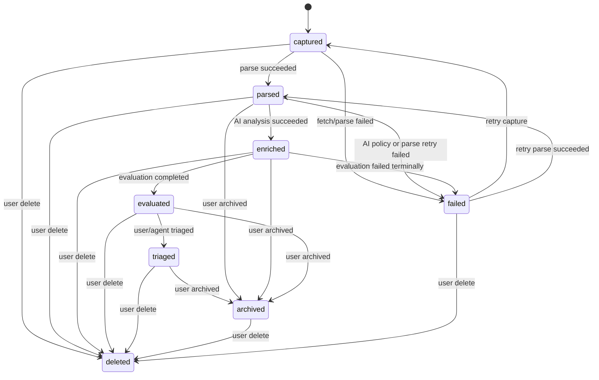
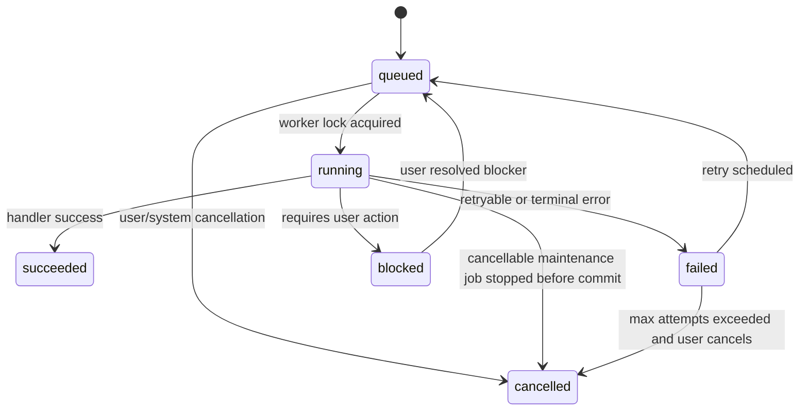
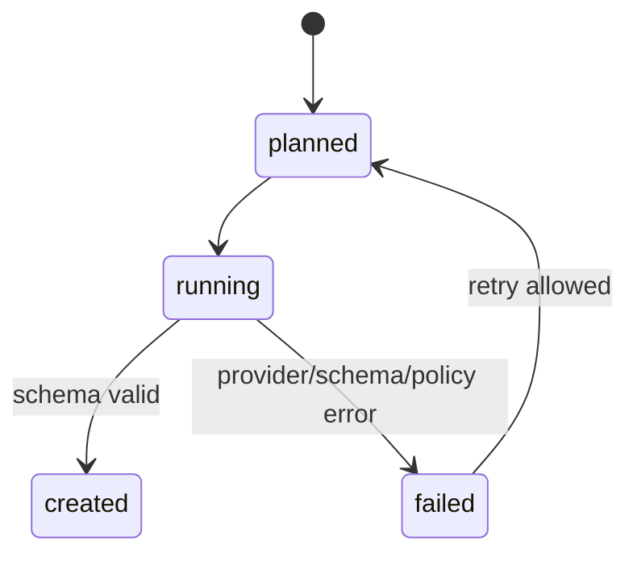
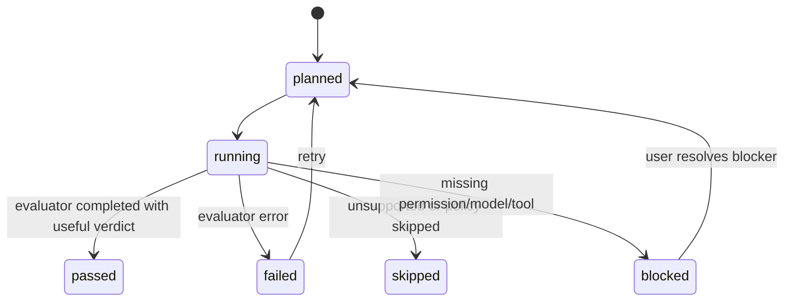
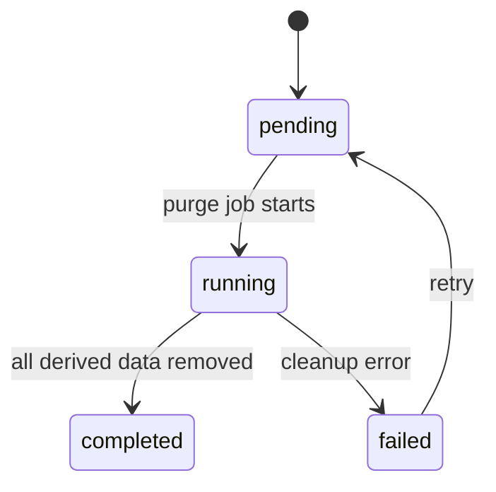
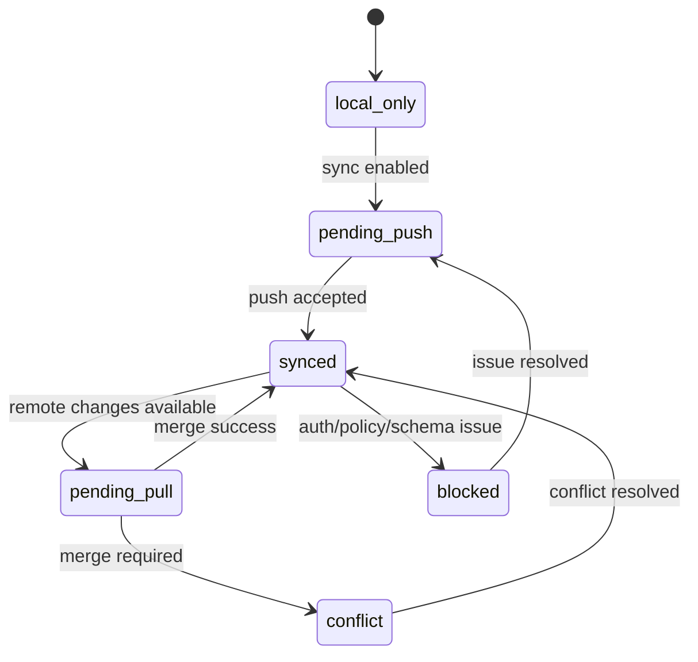

# Link World 状态机规范

状态: Draft  
适用范围: Knowledge Object、Background Job、AI Analysis、Evaluation、Deletion、Sync

## 1. Purpose

本文档定义 Link World 的核心状态流转。任何实现不得用散落的字符串判断替代状态机。状态变化必须由 service 层执行，并在需要时写入 `domain_events`、`background_jobs` 和 `audit_logs`。跨 background job 的同一次关键操作必须保持同一 correlation id；事件 payload 不得复制完整 URL/query/fragment 或正文。

## 2. Knowledge Object Lifecycle

### 2.1 Allowed transitions

| From | To | Trigger | Required side effects |
| --- | --- | --- | --- |
| `captured` | `parsed` | parser success | insert `parsed_documents`, emit `object.parsed`, enqueue AI job if configured |
| `captured` | `failed` | fetch/parse failed | set `failure_reason`, emit `object.failed` |
| `parsed` | `enriched` | AI analysis success | insert `ai_analysis`, insert `ai_traces`, emit `analysis.created` |
| `enriched` | `evaluated` | evaluation success | insert/update `evaluation_runs`, emit `evaluation.completed` |
| any active | `deleted` | user delete | create `deletion_tombstones`, enqueue purge job, emit `object.deleted` |
| `failed` | `captured` | retry capture | clear terminal `failure_reason`, enqueue capture job |
| `failed` | `parsed` | retry parse success | insert new `parsed_documents`, emit `object.parsed` |

### 2.2 Forbidden transitions

- `deleted` -> any active state, except explicit restore flow defined in a future document.
- `archived` -> `captured`, because archive is user intent, not pipeline state.
- `evaluated` -> `parsed` by background worker. New analysis/evaluation should append versions, not regress status.
- Any transition that updates status without writing a corresponding event when event is required.

### 2.3 State precedence

When multiple derived states exist:

- `deleted` wins over all active states.
- `evaluated` wins over `enriched`.
- `enriched` wins over `parsed`.
- `failed` is tied to a specific pipeline step and must not overwrite a more advanced successful state from a different job.

## 3. Background Job Lifecycle

### 3.1 Job status semantics

| Status | Meaning | UI behavior |
| --- | --- | --- |
| `queued` | waiting for worker | show pending if object detail is open |
| `running` | locked by worker | show progress state |
| `succeeded` | completed successfully | hide unless diagnostics requested |
| `failed` | failed with retry or terminal error | show reason and retry if allowed |
| `blocked` | needs user action | show action, e.g. configure model |
| `cancelled` | intentionally stopped | show in diagnostics only |

Search full-index rebuild is a maintenance job exception: while `cancellable=true` and before the atomic `finalizing` swap, the Library UI may show a cancel action and then a short preserved-index confirmation. After `finalizing` begins, cancellation is disabled.

### 3.2 Retry classification

| Error class | Retry |
| --- | --- |
| network timeout | retry with exponential backoff |
| provider rate limit | retry after provider hint or backoff |
| provider auth error | blocked, no automatic retry |
| policy denied | blocked, no automatic retry |
| parser unsupported | terminal failed unless parser version changes |
| invalid model JSON | retry once with repair prompt, then failed |

## 4. AI Analysis Lifecycle

Rules:

- `ai_analysis` rows are append-only by default.
- Every successful analysis must have an `ai_traces` row.
- Failed AI attempts should create job error state, not partial `ai_analysis`.
- If model output schema validation fails, do not store it as successful analysis.

## 5. Evaluation Lifecycle

Rules:

- `evaluation_runs.status` uses `planned`, `running`, `passed`, `failed`, `skipped`, `blocked`.
- A low-value verdict is still a successful evaluation if evaluator ran correctly.
- `failed` means the evaluator failed to produce a valid result.
- `unsafe` verdict does not mean job failed; it means evaluator succeeded and found risk.

## 6. Deletion Lifecycle

Deletion side effects:

1. Hide object from normal UI immediately.
2. Remove FTS rows.
3. Remove vector chunks and metadata.
4. Remove AI analysis and trace.
5. Remove evaluation runs and artifacts.
6. Remove source snapshots and object store files.
7. Record audit log.

## 7. Sync Lifecycle

MVP does not implement cloud sync, but future sync uses these states:

Rules:

- Local app remains usable in all sync states.
- Tombstones sync before normal updates for the same object.
- Most restrictive privacy level wins.

## 8. Implementation Requirements

- State transitions must be represented as Rust domain functions.
- UI must not infer lifecycle by checking table presence.
- Every failed transition must store user-readable reason.
- Every destructive transition must be auditable.
- Tests must cover allowed and forbidden transitions.
