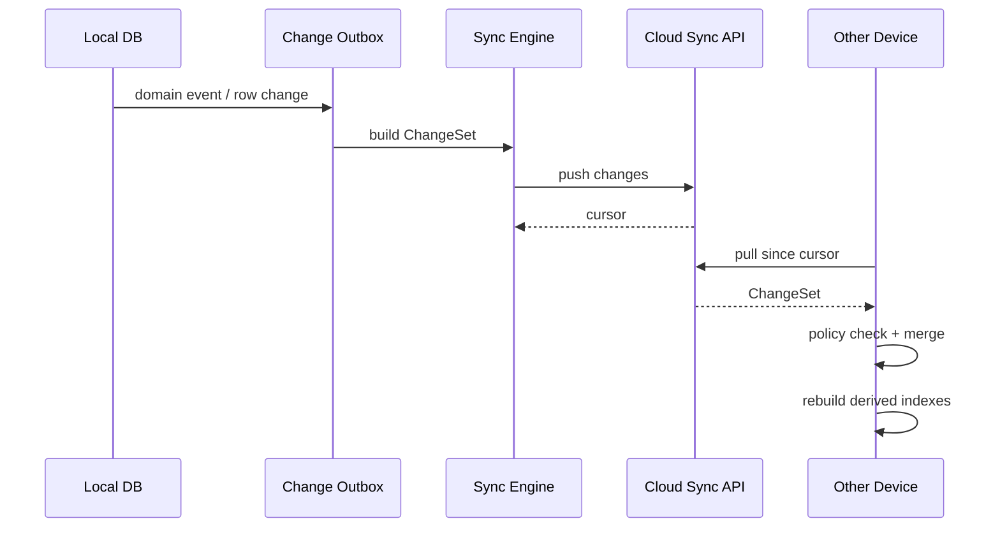

# Link World 多端同步与数据合并架构

状态: Draft  
适用范围: Future Hybrid Edition / Cloud Edition  
MVP 状态: 不实现云同步，但数据库和业务模型必须保留同步边界。

## 1. Purpose

本文档定义 Link World 未来多端同步的设计边界。目标是在 MVP 本地优先阶段就避免把数据模型写死成本机单设备结构，降低后续增加云同步、团队空间和端到端加密的重构成本。

核心原则：

- Local-first：本地库是完整可用副本。
- Cloud optional：云端是同步和协作能力，不是唯一真相源。
- Privacy-aware：同步策略受 privacy level 控制。
- Conflict-safe：冲突不能静默丢数据。
- Rebuildable indexes：FTS、vector、cache 不作为同步真相。

## 2. Sync Modes

| Mode | Description | MVP |
| --- | --- | --- |
| Local-only | 所有数据仅本地 | 必须支持 |
| Metadata sync | 同步对象元数据、标签、集合、状态 | 预留 |
| Full encrypted sync | 同步正文、快照、AI、评估，传输和静态加密 | 预留 |
| Hybrid sensitive local | 敏感内容留本地，低敏元数据同步 | 预留 |
| Team workspace | 多用户协作、权限、共享 collection | Later |

## 3. Sync Identity

需要区分：

- `user_id`: 用户身份。
- `device_id`: 本地设备。
- `profile_id`: 本地 profile，可支持一个设备多用户。
- `workspace_id`: 未来团队空间。
- `object_id`: 全局稳定 UUID。
- `change_id`: 同步变更 UUID。

Rules:

- 所有 syncable row 必须有稳定 ID。
- Local-only 派生数据可以用本地 ID，但不能进入同步包。
- 删除使用 tombstone，不使用“缺失即删除”。

## 4. Syncable vs Local-only Fields

### 4.1 Knowledge objects

Syncable:

- `id`
- `user_id` / future `workspace_id`
- `object_type`
- `title`
- `canonical_url`
- `source_platform`
- `author`
- `privacy_level`
- `lifecycle_status`
- `captured_at`
- `updated_at`

Local-only:

- local file system path。
- window/UI selection。
- transient failure retry locks。
- local parser temporary output。

Conditional:

- `failure_reason`: 可同步脱敏摘要；本地详细错误不默认同步。

### 4.2 Source snapshots

Syncable metadata:

- snapshot id。
- object id。
- snapshot type。
- content hash。
- captured_at。

Conditional content sync:

- `public` / `personal`: 可按用户设置同步。
- `sensitive`: 默认不同步正文，可同步 hash 和 metadata。
- `secret`: 不同步。

Local-only:

- `local://` storage URI。
- local absolute paths。
- browser extension raw temporary data。

### 4.3 Parsed documents

Syncable:

- parser id/version。
- content hash。
- language。
- word count。

Conditional:

- text / markdown content 按 privacy policy 同步。

Local-only:

- local chunk cache。
- temporary parse diagnostics。

### 4.4 AI analysis and traces

Syncable:

- summary。
- category。
- tags。
- key points。
- quality score。
- confidence。
- provider/model metadata。
- prompt template id/version。
- input/output hash。

Conditional:

- full AI output JSON 按 privacy policy。

Local-only:

- raw prompt。
- raw sensitive input。
- detailed provider error。

### 4.5 Evaluation

Syncable:

- verdict。
- score。
- dimensions。
- evidence摘要。
- limitations。
- next actions。
- artifact metadata。

Conditional:

- artifact content 按 privacy policy。

Local-only:

- sandbox temp files。
- local logs。
- screenshots containing sensitive content。

### 4.6 Derived indexes

Never sync as source of truth:

- FTS rows。
- vector chunks。
- embeddings。
- local cache。
- rendered markdown cache。

Strategy:

- 每台设备从 syncable source 重建索引。
- embeddings 是否同步必须单独受 privacy 和 provider policy 控制；默认不作为基础同步项。

## 5. ChangeSet Model

同步使用 ChangeSet，而不是整库覆盖。

```ts
interface ChangeSet {
  id: string;
  userId: string;
  deviceId: string;
  baseCursor?: string;
  createdAt: string;
  changes: SyncChange[];
}

interface SyncChange {
  id: string;
  entityType: string;
  entityId: string;
  operation: 'upsert' | 'delete' | 'purge';
  version: EntityVersion;
  payload: Record<string, unknown>;
}

interface EntityVersion {
  updatedAt: string;
  deviceId: string;
  counter: number;
  hlc?: string;
}
```

## 6. Versioning Strategy

MVP 可先使用：

- `updated_at`
- `device_id`
- monotonic local counter

商业化同步建议引入 HLC (Hybrid Logical Clock)：

- 能表达物理时间。
- 能处理设备时钟轻微漂移。
- 比纯 vector clock 简单。
- 足够支持 LWW 和冲突检测。

Decision:

- 简单标量字段可使用 LWW with HLC。
- 用户正文编辑、tags、collections、AI analysis、evaluation 不使用静默覆盖。

## 7. Conflict Resolution

### 7.1 Field-level policy

| Field type | Policy |
| --- | --- |
| title | LWW with conflict history |
| lifecycle_status | state-machine aware merge |
| privacy_level | most restrictive wins |
| tags | set union |
| collections | set union with sort conflict fallback |
| user notes | keep both versions |
| AI analysis | append-only by analysis id |
| evaluation runs | append-only by run id |
| source snapshots | content hash dedupe |
| deletion tombstone | tombstone wins over normal update |

### 7.2 Lifecycle merge

Lifecycle status is not plain LWW.

Rules:

- `deleted` / tombstone wins over active states。
- `failed` does not overwrite `enriched` or `evaluated` from another device unless it refers to same job attempt。
- `evaluated` implies `enriched` if analysis exists。
- `archived` is user intent and can override `triaged`。

### 7.3 Privacy merge

Most restrictive wins:

```text
secret > sensitive > personal > public
```

If one device marks an object `secret`, other devices must:

- stop third-party AI jobs。
- stop full-content sync。
- purge synced sensitive content if policy requires。

## 8. Tombstone Sync

Deletion flow across devices:

1. Device A creates `deletion_tombstones` with mode。
2. Tombstone syncs to cloud。
3. Device B pulls tombstone。
4. Device B hides object immediately。
5. Device B enqueues local purge job。
6. Device B removes FTS, vector chunks, cache and local artifacts。
7. Device B marks tombstone purge completed locally。

Rules:

- Tombstone must include object id, deletion mode, timestamp, actor, reason。
- Tombstones are retained long enough to prevent deleted objects from reappearing。
- Recreating same URL after deletion creates a new object id unless user explicitly restores。
- Purge failures must be visible in diagnostics。

## 9. Sync Pipeline



## 10. Encryption Model

Future options:

- Transport encryption only: simpler, cloud can process data。
- Per-user encrypted object payloads: cloud stores opaque blobs。
- Collection-level keys: flexible sharing but more complex。
- Workspace keys: required for team collaboration。

Default planning assumption:

- Local-only secrets never sync。
- Sensitive正文默认不上传。
- If full encrypted sync is enabled, content encryption happens before upload。
- Cloud metadata may remain visible unless E2EE mode is selected。

## 11. Sync API Draft

```ts
interface SyncProvider {
  push(changes: ChangeSet): Promise<SyncCursor>;
  pull(cursor: SyncCursor): Promise<ChangeSet>;
  acknowledge(changeIds: string[]): Promise<void>;
  resolveConflict(conflict: SyncConflict): Promise<ResolvedChange>;
}
```

Required server behavior:

- idempotent push by change id。
- cursor-based pull。
- tombstone retention。
- per-user/workspace isolation。
- no secret content logging。

## 12. Sync Failure Modes

| Failure | Behavior |
| --- | --- |
| Network unavailable | queue changes locally |
| Auth expired | mark sync blocked, keep local app usable |
| Conflict detected | keep both or apply policy, never silent drop |
| Tombstone purge failed | hide object, retry cleanup |
| Schema mismatch | stop sync, require app update |
| Policy denial | skip content, sync metadata if allowed |

## 13. MVP Guardrails

Even before sync exists:

- Avoid local absolute paths in syncable fields。
- Use stable UUIDs for all primary entities。
- Keep AI analysis and evaluation append-only。
- Keep tombstones separate from objects。
- Treat FTS/vector/cache as rebuildable。
- Do not store API keys in syncable tables。
- Include parser/evaluator/model versions in derived data。

## 14. Sync Acceptance Criteria

Future implementation must satisfy:

- Two devices can create different tags for same object; result includes both tags。
- Deleting object on one device hides and purges it on another。
- Marking object sensitive on one device prevents third-party AI on another。
- AI analysis from two devices coexists by analysis id。
- FTS and vector index are rebuilt after pull, not blindly synced。
- Cloud auth failure does not break local save/search/read。
