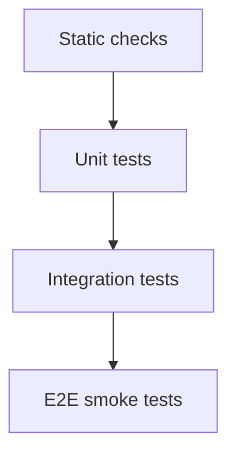

# Link World 测试规范

状态: Draft  
适用范围: Rust backend、React frontend、Tauri IPC、AI prompts、evaluators、database migrations

## 1. Purpose

本文档定义 Link World 的测试分层、最低覆盖要求、fixtures 规范和评测数据管理。目标是保证 Local-first、AI trace、Evaluation Engine、隐私策略、迁移和 UI 状态在持续迭代中不退化。

## 2. Test Pyramid

Recommended ratio:

- Static checks: every commit.
- Unit tests: broad and fast.
- Integration tests: critical workflows.
- E2E tests: fewer, high-value user flows.
- AI evals: deterministic dataset plus tolerance thresholds.

## 3. Static Checks

Required:

- TypeScript strict typecheck.
- Frontend lint.
- Rust fmt.
- Rust clippy.
- Secret scanning.
- SQL migration syntax check.

Failure is release-blocking for:

- type errors.
- clippy high-confidence warnings.
- detected secret.
- migration failure.

## 4. Backend Tests

### 4.1 Unit tests

Must cover:

- lifecycle state transitions.
- job retry classification.
- `AppError -> IpcErrorCode` mapping.
- privacy policy decisions.
- plugin permission checks.
- object store path canonicalization.
- AI output schema validation.

### 4.2 Integration tests

Must cover:

- empty DB migration.
- previous DB migration.
- capture submit creates object, event and job.
- parse writes source snapshot and parsed document.
- AI enrich writes analysis and trace.
- evaluation writes run and artifacts.
- delete creates tombstone and purge removes derived data.
- FTS search uses parsed document and AI summary.

### 4.3 Job idempotency tests

Must verify:

- repeated parse with same hash does not duplicate canonical parsed document.
- repeated AI job either deduplicates by input hash or appends intentional version.
- repeated purge stays successful.
- repeated event handling does not duplicate FTS rows.

## 5. Frontend Tests

Component tests:

- `ObjectListItem` renders all lifecycle states.
- `ObjectDetail` handles loading, empty, failed and deleted.
- `AIAnalysisPanel` shows summary, score, risk and trace.
- `EvaluationPanel` shows verdict, evidence and limitations.
- `SettingsPanel` masks API key.
- `PluginPermissionPanel` distinguishes required vs optional permissions.

Interaction tests:

- Add URL submit.
- Search keyboard navigation.
- Trigger evaluation.
- Retry failed job.
- Delete object confirm.

## 6. E2E Smoke Tests

MVP smoke tests:

1. App starts on clean profile.
2. User adds URL.
3. Object appears as `captured` then `parsed`.
4. Detail shows parsed document.
5. Search finds object by title/body.
6. Configure fake model provider.
7. AI analysis fixture response writes trace.
8. Trigger evaluation fixture response writes verdict.
9. Delete object.
10. Search no longer returns object.

## 7. Fixtures Policy

Fixtures live under `tests/fixtures`.

Rules:

- No real user data.
- No real API keys.
- No copyrighted full articles.
- Prefer small deterministic samples.
- Include both successful and failed cases.
- Include sensitive/secret examples using fake content.

Fixture categories:

- capture payloads.
- parsed documents.
- AI model responses.
- evaluation results.
- database seed records.
- external API error responses.

## 8. AI Evaluation Tests

AI evals live under `evals/dataset`.

Evaluation dimensions:

- JSON schema validity.
- summary groundedness.
- risk detection.
- useful action items.
- verdict consistency.
- hallucination avoidance.
- refusal/policy correctness for sensitive data.

Minimum gates:

- 100% valid JSON for strict-output prompts.
- No secret leakage in outputs.
- Required fields present.
- Verdict belongs to allowed enum.

## 9. Regression Tests

Every fixed bug should add one of:

- unit test.
- integration test.
- fixture.
- eval sample.
- documented manual regression step if automation is impractical.

## 10. Test Data Refresh

When schema changes:

- update DB fixtures.
- update API DTO fixtures.
- update eval expected schema.
- update migration tests.

When prompt changes:

- update eval dataset version.
- run JSON validity check.
- compare verdict distribution.

## 11. Release Test Checklist

Before release:

- static checks pass.
- Rust tests pass.
- frontend tests pass.
- migration tests pass.
- E2E smoke pass.
- AI eval JSON validity pass.
- no secret scan findings.
- manual Windows package smoke pass.
