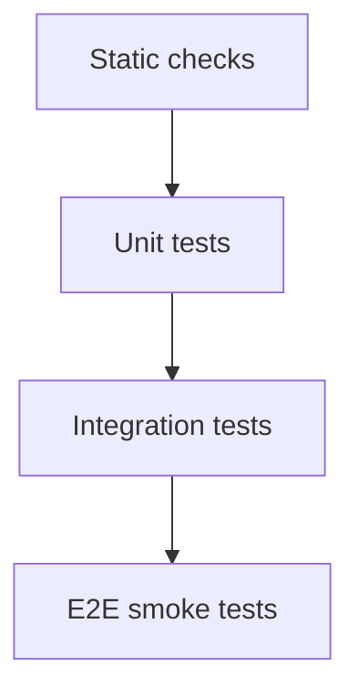

# Link World 测试规范

状态: Draft  
适用范围: Rust backend、React frontend、Tauri IPC、浏览器扩展、Loopback Capture、文档解析器、AI prompts、evaluators、database migrations

## 1. Purpose

本文档定义 Link World 的测试分层、最低覆盖要求、fixtures 规范和评测数据管理。目标是保证 Local-first、捕获与解析边界、AI trace、Evaluation Engine、隐私策略、迁移和 UI 状态在持续迭代中不退化。

文章处理链路必须保持以下职责边界：

```text
Browser extension -> sanitized DOM snapshot --\
                                              +-> Rust document parser -> normalized text and Markdown
URL capture       -> fetched HTML snapshot ----/                            |
                                                                              v
                                                                    React safe renderer
```

浏览器扩展不得承担网站特定的 Markdown 序列化或正文排版；URL 抓取和扩展 DOM 捕获必须复用同一 Rust 文档解析器。AI 可以作为后续增强能力，但不得成为基础正文解析和显示正确性的必要条件。

## 2. Test Pyramid



Recommended ratio:

- Static checks: every commit.
- Unit tests: broad and fast.
- Integration tests: critical workflows.
- E2E tests: fewer, high-value user flows.
- AI evals: deterministic dataset plus tolerance thresholds.

## 3. Static Checks

Required:

- TypeScript strict typecheck.
- Frontend lint.
- Rust fmt.
- Rust clippy.
- Browser extension JavaScript syntax check.
- Browser extension manifest JSON validation.
- Secret scanning.
- SQL migration syntax check.

Failure is release-blocking for:

- type errors.
- clippy high-confidence warnings.
- invalid browser extension scripts or manifest.
- detected secret.
- migration failure.

## 4. Backend Tests

### 4.1 Unit tests

Must cover:

- lifecycle state transitions.
- job retry classification.
- `AppError -> IpcErrorCode` mapping.
- privacy policy decisions.
- plugin permission checks.
- object store path canonicalization.
- AI output schema validation.
- document parser root selection without platform-specific assumptions.
- document parser preserves headings, paragraphs, lists, blockquotes, code blocks and tables.
- document parser removes duplicate leading titles and ignores script, style and navigation noise.
- verification-page detection rejects real challenges without rejecting substantive articles that discuss authentication or CAPTCHA topics.
- capture failure classification emits stable `capture.*` user-facing reasons for timeout, unreachable network, HTTP 403, verification pages, unsupported schemes, oversized responses and no-readable-text pages.
- document parser rejects unsafe link and image protocols in generated Markdown.

### 4.2 Integration tests

Must cover:

- empty DB migration.
- previous DB migration.
- URL capture submit creates object, event and fetch job.
- fetched HTML parse writes source snapshot and parsed document with parser ID and version.
- browser extension Loopback payload maps sanitized DOM and metadata into a confirmed capture item.
- browser DOM capture and fetched HTML use the same document parser and produce the same structural Markdown contract.
- parsed title, author and language metadata are persisted when available.
- AI enrich writes analysis and trace.
- provider registry maps every supported API family and preserves typed auth/rate-limit/timeout/schema errors.
- AI enrichment failures persist stable sanitized `ai.*` reasons for timeout, auth, rate limit, missing model, invalid output schema, policy denial, missing default config, provider unavailability, secret storage and local persistence failures.
- migration 0003 preserves old provider rows and defaults them to OpenAI Chat Completions.
- migration fixtures use the production SQLx migrator truncated at versions 1/2/3, preserving real checksum metadata instead of hand-authored schemas.
- v1 fixture carries 1000 objects plus snapshot/document/AI trace/Evaluation/failed job/FTS/provider/tombstone data; future unknown migration versions fail closed.
- backup service publishes only complete staging directories, verifies manifest/payload hashes, rejects unsafe paths and runs SQLite quick_check.
- restore prepare re-verifies the source, creates a safety backup, migrates and validates a private candidate before writing pending state.
- restart restore covers deterministic interruption at prepared, moving-live, live-moved and candidate-installed, including partial candidate install and optional WAL/SHM preservation.
- I/O boundaries cover source hash changes during copy, duplicate prepare, candidate tampering and missing required rollback payload.
- startup migration protection covers existing-schema restore-point creation, fresh DB bypass, running-phase retry blocking, and committed-migration guard convergence.
- startup recovery state redacts app data paths, extracts verified backup id, and does not require normal `AppState` for safe backup catalog/status commands.
- `StorageSettings(mode=startupRecovery)` hides create backup, surfaces the verified backup id, and retains explicit restore confirmation.
- evaluation writes run and artifacts.
- portable export writes manifest/JSONL/metadata/markdown, skips secret objects, and omits source/evaluation storage URI, credential references and secret body content.
- delete creates tombstone and purge removes derived data.
- startup job recovery requeues interrupted `capture.fetch_url` jobs with retry budget, fails exhausted capture jobs, and fails running jobs without registered recovery runners.
- capture fetch failures for verification pages, HTTP 403 and unsupported schemes persist actionable failure reasons and do not create parsed documents.
- repeated manual URL capture with the same normalized canonical URL returns the existing object, sets `deduplicated=true`, and does not create another snapshot or background job.
- FTS search uses parsed document and AI summary.
- FTS search ranks title matches above repeated body-only matches according to documented weights, and suppresses snippets for `secret` objects.
- FTS search composes with Library filters for object type, `inbox` lifecycle and `failed` lifecycle semantics.
- search index health detects missing, stale, orphaned and duplicate FTS rows without returning content snippets.
- search benchmark fixtures generate a deterministic corpus that covers object type filters, failed lifecycle filtering, secret snippets, parsed content and AI summary matches; CI runs the small smoke corpus, while 5k and 20k object benchmarks stay `#[ignore]` and are run manually before search/schema releases.
- staged full-index rebuild reports persisted progress, publishes through an atomic FTS swap, preserves the existing index when cancelled before finalizing, and makes completed rebuilds non-cancellable.

### 4.3 Job idempotency tests

Must verify:

- repeated parse with same hash does not duplicate canonical parsed document.
- repeated AI job either deduplicates by input hash or appends intentional version.
- startup after crash leaves no permanent `running` background jobs.
- repeated purge stays successful.
- repeated event handling does not duplicate FTS rows.

## 5. Frontend Tests

Component tests:

- `ObjectListItem` renders all lifecycle states.
- `ObjectDetail` handles loading, empty, failed and deleted.
- `ObjectDetail` renders Markdown when available and falls back to parsed plain text.
- `ObjectDetail` formats persisted `capture.*` failure reasons as recovery-oriented user text and does not expose raw diagnostic prefixes as primary copy.
- capture failure formatter maps stable `capture.*` prefixes to deterministic titles while preserving legacy free-text reasons.
- `CaptureBar` renders formatted capture failure titles/messages and hides raw `capture.*` prefixes from the visible status copy.
- `CaptureBar` renders duplicate URL submissions as an already-saved state and does not imply that a new capture job was created.
- AI failure formatter maps stable `ai.*` prefixes to deterministic titles/actions while preserving legacy free-text reasons.
- `MarkdownDocumentView` renders headings, lists, blockquotes, fenced code and GFM tables.
- `MarkdownDocumentView` does not render raw HTML and rejects unsafe link or image protocols.
- `MarkdownDocumentView` keeps remote images lazy, prevents referrer leakage and disables task-list inputs.
- Markdown AST analysis produces stable heading IDs, a bounded table of contents and deterministic display modes.
- long code blocks support copy and collapse interactions without loading a syntax-highlighting engine.
- valid AI display hints apply only to their source parsed document; stale, invalid and low-confidence hints fall back to AST inference.
- `StorageSettings` portable export button calls `usePortableExport`, displays exported object/secret-skip summary, and is hidden in startup recovery mode.
- `AIAnalysisPanel` shows run state, summary and trace, contains no provider credential form, and links to Settings.
- `EvaluationPanel` shows verdict, evidence and limitations.
- model provider settings list multiple stable ids without returning API keys, create/edit/delete configs, enforce one explicit default, allow protocol selection, clear key drafts after save and invalidate stale connection-test success after edits.
- Sidebar filters All/Inbox/Articles/GitHub/Prompts/Failed through backend semantics; ObjectList appends 30-item pages without duplicates.
- `ObjectList` renders actionable search empty/error states and displays rebuild progress, cancel action and non-cancellable finalizing boundary.
- `PluginPermissionPanel` distinguishes required vs optional permissions.

Interaction tests:

- Add URL submit.
- Search keyboard navigation.
- Trigger evaluation.
- Retry failed job.
- Delete object confirm.
- Rebuild and Reindex update search state without changing parsed document content.

## 6. E2E Smoke Tests

MVP smoke tests:

1. App starts on clean profile.
2. User adds a URL through the desktop capture bar.
3. Object appears as `captured` then `parsed`.
4. Detail shows structured Markdown without a duplicated title.
5. Search finds the object by title and body.
6. User captures the same synthetic article through the browser extension.
7. Extension capture is `parsed` and preserves the same content boundaries and block structure as URL capture.
8. A selected-text capture stores only the explicit selection and does not substitute the surrounding DOM article.
9. Rebuild and Reindex leave the parsed document unchanged.
10. Configure two fake model providers, connection-test one, select an explicit default, reopen Settings and verify no key is returned.
11. Switch library lifecycle/type filters and load a second page without duplicate rows.
12. AI analysis fixture response writes trace.
13. Trigger evaluation fixture response writes verdict.
14. Delete object.
15. Search no longer returns object.

If CI cannot automate an installed browser extension, steps 6-8 must be covered by Loopback contract integration tests and repeated as a manual Chrome smoke test before release.

## 7. Fixtures Policy

Fixtures live under `tests/fixtures`.

Rules:

- No real user data.
- No real API keys.
- No copyrighted full articles.
- Prefer small deterministic samples.
- Include both successful and failed cases.
- Include sensitive/secret examples using fake content.
- Generalize a real-site regression into the smallest synthetic HTML structure that reproduces the bug.
- Do not add a platform-specific selector unless a standards-based or structural heuristic cannot represent the case.
- Real pages may be used for local manual verification, but their full HTML must not be committed.

Fixture categories:

- capture payloads.
- sanitized browser DOM payloads.
- semantic article HTML with expected plain text and Markdown.
- malformed, noisy and verification-page HTML.
- parsed documents.
- AI model responses.
- evaluation results.
- database seed records.
- deterministic search benchmark records for small smoke, 5k and 20k object corpora.
- valid and tampered backup manifests/object payloads.
- generated database fixtures from every published migration baseline; current automated baselines are 0001/0002/0003.
- real-process forced termination at prepared, moving-live, live-moved and candidate-installed boundaries in the Windows installation test matrix.
- external API error responses.

Parser fixtures should cover at least:

- schema.org `articleBody` content.
- generic `article` and `main` content.
- duplicate page title and article heading.
- nested lists, blockquotes, fenced code and tables.
- script/style/navigation noise.
- short verification pages and long legitimate articles mentioning verification terms.
- safe and unsafe link/image protocols.

Expected parser results must assert both normalized `textContent` and `markdownContent`. When parser behavior intentionally changes, update the parser version and fixture expectations in the same change.

## 8. AI Evaluation Tests

AI evals live under `evals/dataset`.

Evaluation dimensions:

- JSON schema validity.
- summary groundedness.
- risk detection.
- useful action items.
- verdict consistency.
- hallucination avoidance.
- refusal/policy correctness for sensitive data.

Minimum gates:

- 100% valid JSON for strict-output prompts.
- No secret leakage in outputs.
- Required fields present.
- Verdict belongs to allowed enum.

## 9. Regression Tests

Every fixed bug should add one of:

- unit test.
- integration test.
- fixture.
- eval sample.
- documented manual regression step if automation is impractical.

Capture and rendering regressions require route-specific coverage:

- parser bugs: assert both URL HTML and browser DOM routes where applicable.
- renderer bugs: add a component test using deterministic Markdown.
- extension transport bugs: add a Loopback payload contract test.
- site-specific reports: encode the structural cause in a synthetic fixture instead of storing the original article.

## 10. Test Data Refresh

When schema changes:

- update DB fixtures.
- update API DTO fixtures.
- update eval expected schema.
- update migration tests.

When prompt changes:

- update eval dataset version.
- run JSON validity check.
- compare verdict distribution.

When the document parser changes:

- update parser ID/version when persisted output semantics change.
- update expected text and Markdown fixtures.
- run URL and browser DOM parity tests.
- verify existing records are not assumed to be reparsed by Rebuild or Reindex.

When AI display hints change:

- increment the AI analysis and prompt schema versions when persisted semantics change.
- verify old analyses without `displayHints` still deserialize.
- verify invalid optional hints never fail the main summary analysis.
- verify AI hints cannot alter Markdown content or renderer security policy.

When the browser capture payload changes:

- update capture DTO fixtures and Loopback contract tests.
- verify payload byte limits and UTF-8 truncation.
- reload the unpacked extension and run the manual Chrome smoke test.

When the Markdown renderer or its dependencies change:

- run component tests for GFM structure and plain-text fallback.
- repeat unsafe HTML, URL protocol and remote-image privacy checks.

## 11. Release Test Checklist

Before release:

- static checks pass.
- Rust tests pass.
- frontend tests pass.
- frontend production build passes.
- browser extension scripts and manifest pass static validation.
- migration tests pass.
- E2E smoke pass.
- direct URL and browser extension captures pass against the same synthetic structured article.
- Markdown safety regression checks pass.
- AI eval JSON validity pass.
- no secret scan findings.
- manual Windows package smoke pass.
- manual Chrome unpacked-extension capture smoke pass when extension automation is unavailable.
